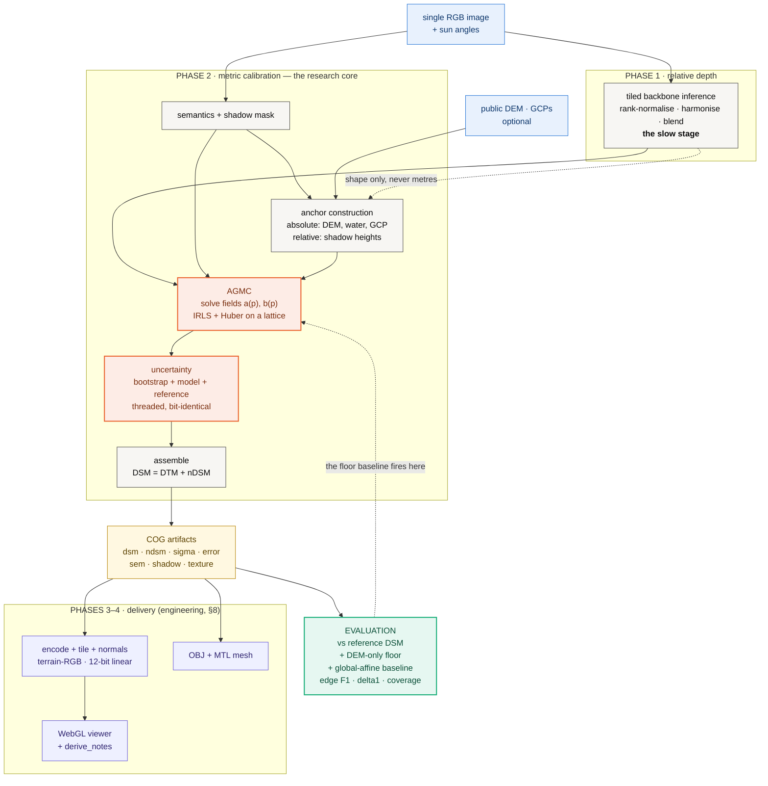

# TRAKSHA

**An investigation into metric grounding of monocular depth for DSM
reconstruction** — an anchor-graph calibration formulation, a diagnosed failure
mode, and a partial repair measured on real imagery.

> ### Research status — failure diagnosed, partly repaired
>
> TRAKSHA performs reproducible spatially-varying metric calibration on **real
> imagery with airborne lidar ground truth**, and **does not yet produce a
> usable Digital Surface Model.**
>
> Calibrated from anchors alone it is indistinguishable from a flat sheet across
> four European city centres — **1.2% of true relief**, 1% better than
> predicting zero height everywhere. The cause is measured, not guessed: on real
> imagery every anchor is a *ground* anchor, terrain needs a scale **51× smaller**
> than buildings do, and one affine field per neighbourhood serves the majority.
>
> Supplying that missing scale — **one constant, fitted once over the dataset** —
> recovers **36% of true relief** and beats the flat-ground floor by **29%**,
> while elevation MAE gets *worse*. That trade is the finding: on this problem
> the headline metric and reconstruction quality point in opposite directions,
> so a project steering by MAE would reject the only change that recovered any
> structure. The surface has stopped being flat; it has not started being right.

**Reading order.** §3.1 and §3.2 are the result and the reason it needs two
tables. §4 is why. §5 is the one thing here that is learned, and §5.6–§5.7 are
two refinements that were built, measured and found not to work — recorded so
they are not built again. Everything is CPU-only and reproducible from two
commands (§2.7).

## Research question

> Can spatially varying metric constraints convert monocular *relative* depth
> into a metrically grounded DSM, without a second view and without a learned
> metric head?

Monocular depth models (§[Related work](#10-positioning-and-related-work))
predict relative depth well — a surface correct up to an unknown, spatially
varying scale and offset. They cannot say how many metres. Stereo, lidar and
InSAR can, and all require an acquisition the single image does not have.
**The gap is not perception; it is metric grounding.**

## Hypotheses

**H1 — spatial calibration.** A single global affine transform `H = aD + b` is
insufficient, because a scene's metric error is spatially structured. Replacing
the two scalars with two smooth *fields* over a lattice should reduce error.

**H2 — frequency separation.** Terrain elevation and object height occupy
different spatial-frequency regimes, and a monocular backbone's low-frequency
output carries terrain and structure at scales that demand very different
metric factors. Metric grounding should therefore decompose depth by frequency
and constrain each band with the source that observes it — terrain from a DEM,
structure from an observation of structure.

**Status: both tested on real imagery with airborne lidar truth. H1 is
supported. H2 is implemented and run end to end; it moves structure and not
scale, because on real data its scale branch received no anchors at all
(§5.2).**

## Contributions

1. **Anchor-graph metric calibration (AGMC)** — a formulation converting
   monocular relative depth into a spatially varying metric surface by solving
   two smooth fields against heterogeneous metric constraints.
2. **Explicit absolute/relative anchor semantics** — shadow-derived height
   constraints enter the linear system as a *difference of two rows*, which
   structurally prevents a height measurement being read as an elevation.
3. **A calibration failure diagnosis, measured on real imagery** — terrain
   supplies every anchor and needs a scale 51× smaller than the buildings do, so
   one affine field per neighbourhood serves terrain and flattens structure,
   reducing the method to a DEM interpolator.
4. **A frequency-domain account** — terrain and structure occupy different
   spatial-frequency bands, and only the high band carries object signal that
   survives to the output.
5. **A dual-frequency calibration formulation** derived from that diagnosis,
   implemented and run — together with a precise account of why it is not
   sufficient alone (its scale branch is fitted from object anchors, and real
   imagery without published acquisition times yields none), and a fitting step
   that supplies what the anchors cannot observe.
6. **A protocol designed to expose degenerate reconstructions** rather than
   rely on global MAE — a DEM-only floor, a flat-ground floor on height above
   ground, an edge-structure metric, and a ratio metric. All of them fired on a
   surface that MAE called an improvement.

Contribution 6 is the one we would defend hardest, and §3.1 is why: the repair
in §5 makes elevation MAE **worse** while tripling correlation and raising δ₁
25-fold. **A project steering by the headline number would reject the only
change that recovered any structure.**

## Status at a glance

| | |
|---|---|
| Formulation | spatially varying scale + offset fields, IRLS/Huber, lattice-discretised |
| Evaluation | **4 real city centres**, N=4, airborne lidar truth |
| Imagery | **aerial, not satellite** — swisstopo open geodata (§2.8) |
| Compute | **CPU only, by design** — no GPU path exists (§7.3) |
| Learned | **one constant**: the structural scale, fitted over the dataset (§5) |
| H1 (spatial > global) | **supported** — MAE 8.39 vs 11.18 m |
| Clears DEM-only floor? | **no** — 8.39 vs 8.47 m, a 0.9% margin on a 1.35 m spread |
| Clears flat-ground floor? | **yes, with the fitted scale** — 5.41 vs 7.59 m (−29%); without it, no (−1%) |
| Structure recovered | **36%** (ViT-L), **27%** (ViT-S) — was 1.2% and 0.4% |
| Structure *accurate*? | **no** — Zürich overshoots its tallest by 45%, Geneva undershoots by 27% |
| Uncertainty calibrated | **no** — 1σ coverage 0.43, and blind to the bias that dominates |
| Delivery | **all four phases, one folder per scene** — rasters, tileset, textured OBJ (§3.6) |

---

# 1. Method



**Figure 1 — the whole pipeline.** Two edges carry the design. The dashed
`depth → anchors` edge is the commitment that anchors come from the image and
auxiliary data, **never from the depth field**: depth supplies *shape*, the
anchor graph supplies *metres*. The dashed `evaluation → AGMC` edge is the one
this project turns on — the DEM-only floor baseline is what revealed that the
calibration had degenerated (§4), and it is why the protocol is a contribution
rather than boilerplate.

Everything downstream of the COG artifacts **only reads** them, so no number in
the viewer or the mesh can be one the calibration did not produce. Phases 3–4
are engineering and are reported in §8; the research core is Phase 2.

## 1.1 Problem statement

Let $D(p) \in [0,1]$ be the backbone's relative depth at pixel $p$, rank-
normalised per inference chip. We seek metric elevation $H(p)$ under an affine
model with spatially varying coefficients:

$$ H(p) = a(p) D(p) + b(p) $$

- $a(p)$ — scale field, metres per unit of relative depth
- $b(p)$ — offset field, metres (the local datum)
- $H(p)$ — metric elevation, metres

The global-affine baseline is the special case $a(p) = a$, $b(p) = b$.

## 1.2 Structural segmentation

SAM 2 [13] runs **before** depth, over the image alone, and produces the one
thing the pipeline never had: instances. Until this stage existed the only
structural knowledge in the system was a colour and texture heuristic with no
instance ids and no confidence (§3.4), so nothing downstream could tell one
building from the next — and the delivered mesh welded every building to the
ground and to its neighbours because no edge in it corresponded to a structure.

The model is loaded through `transformers`, which ships the official SAM 2
architecture, so it uses the same Hugging Face path as the depth backbones.
Automatic mask generation is **not** provided there and is implemented in
`traksha/semantics/sam2.py`: a regular grid of point prompts, three candidate
masks per point, filtering on the model's own predicted IoU and on a stability
score, then NMS. The image is encoded once and every prompt batch reuses the
embedding; re-encoding per batch would spend the stage's whole budget on the
part of the model that does not depend on the prompt.

**The thresholds favour recall, on purpose.** SAM 2 is class-agnostic — it
segments roads, courtyards and shadows as readily as roofs — so this stage
cannot and does not decide what a building is. That decision needs height, and
height does not exist until Chhaya has run. The precision filter is therefore
downstream, which means a false instance here is cheap and a missed one is not.

**Model selection was measured, not assumed** (`scripts/bench_segmentation.py`).
Scoring against the lidar nDSM — of the pixels carrying more than 2.5 m of real
structure, how many does some mask cover — over three swisstopo city scenes:

| variant | params | generate | built recall | precision |
|---|---|---|---|---|
| `sam2-tiny` | 31.4 M | 59 s | 50.9 % | 52.8 % |
| **`sam2-base`** | **73.3 M** | **58 s** | **73.0 %** | **57.0 %** |

Base wins on every scene, by 22 points on average, for no measurable extra
generation time — the point grid, not the encoder, is what this stage spends its
time on. Taking the smallest model would have cost a fifth of the structure the
rest of the pipeline exists to reconstruct. It is the default; `--instances off`
restores the previous behaviour, and the artifact records which was used.

The stage costs 48.6 s at 1024 px with a 16×16 grid on the reference CPU, of
which 15.7 s is loading weights. Its output is written as an artifact in its own
right — `segmentation/instances.tif`, `boundary.tif`, `confidence.tif` and
`metadata.json` — because every stage after it reads the instance ids, and the
boundary map is what the geometry stage will cut along.

## 1.3 Relative depth

Depth Anything V2 [1] is run tiled — one of six selectable backbones, all frozen and pretrained (§2.1). Three steps make the mosaic usable:
per-chip **rank normalisation** (the backbone's per-image scale is arbitrary, so
only the ordering is kept); **overlap harmonisation**, fitting each new chip to
the existing mosaic with a Huber-reweighted affine over the overlap band alone;
and a **flat-top raised-cosine window** that is exactly 1 across the chip
interior so interior pixels are never attenuated.

Sign convention, stated once: the backbone returns higher values for surfaces
closer to the sensor; from nadir, closer means higher, so $D$ maps monotonically
to height. There is no flip anywhere in the pipeline.

## 1.4 Anchors: absolute and relative

An anchor is a statement about the world in metres, with a confidence weight.

| source | assertion | kind | count/scene | weight |
|---|---|---|---|---|
| DEM (Copernicus GLO-30 [4]) | "this bare-earth pixel is at 412.3 m" | absolute | ~3840 | $\min(1, 3/\sigma_{\text{src}})$ |
| water bodies | "this lake is at one elevation" | absolute | ~70 | 0.9 |
| cast shadows | "this roof is $h$ m above the ground at its foot" | **relative** | ~65 | see below |
| GCPs | "this surveyed pixel is at 118.02 m" | absolute | 0 here | 1.0 |

**Semantic gating.** A public DEM approximates bare earth, so a DEM sample on a
rooftop is not a weak constraint — it is a wrong one. Samples are admitted only
on bare ground, road or water, on a 16 px stride, and dropped where the DEM's
own slope exceeds 25°.

**Shadow height** follows the standard cast-shadow relation, with $L$ the shadow
run length in pixels, $g$ the ground sample distance and $\alpha$ the sun
elevation:

$$ h = L \cdot g \cdot \tan\alpha $$

$L$ is the *median* of many parallel runs marched along the anti-solar direction
from every shaded-side boundary pixel, not one blob dimension. Each shadow
anchor is weighted by three independent factors in $[0,1]$:

$$ w = \underbrace{\mathrm{clip}\Big(\tfrac{\alpha-20}{10}\Big)\mathrm{clip}\Big(\tfrac{75-\alpha}{10}\Big)}_{\text{sun-angle gate}} \cdot \underbrace{\Big(1 - \tfrac{\mathrm{MAD}(L_i)}{\bar{L}}\Big)}_{\text{crispness}} \cdot \underbrace{\Big(1 - \tfrac{\text{neighbour px in ring}}{\text{ring px}}\Big)}_{\text{isolation}} $$

**The absolute/relative distinction is structural, not a weighting choice.** A
shadow measures a height, never an elevation. Relative anchors therefore
constrain a *difference*:

$$ H(p_k) - H(q_k) = h_k $$

where $p_k$ is the roof and $q_k$ a reference pixel at the building's foot.
Collapsing this into an absolute constraint is how a good height anchor silently
becomes a bad datum anchor.

## 1.5 AGMC: the optimisation problem

The fields are discretised on a lattice of stride 32 px, with each anchor spread
bilinearly over its four surrounding nodes ($\sum_j \beta_j = 1$). With $m$
anchors and $n$ lattice nodes, the unknown is $x = [ a; b ] \in \mathbb{R}^{2n}$.

**Objective.**

$$ E(a,b) = \underbrace{\sum_{k=1}^{m} w_k \rho\big(H(p_k) - h_k\big)}_{\text{data}} + \underbrace{\lambda_a \lVert \nabla a \rVert^2 + \lambda_b \lVert \nabla b \rVert^2}_{\text{smoothness}} + \underbrace{\lambda_p \lVert a - a_{\text{glob}} \rVert^2}_{\text{prior on scale only}} $$

subject to

$$ a(p) \ge a_{\min} $$

$\rho$ is the Huber loss; $a_{\text{glob}}$ is a robust global affine fit used
only as a weak prior. **$b$ carries no prior**: the datum is exactly what the
anchors exist to determine.

**Normal equations.** All terms are quadratic in $x$, so each IRLS iteration is
one sparse solve:

$$ \big(A^{\top} W A + R + P\big) x = A^{\top} W h + P x_{\text{prior}} $$

$$ R = \mathrm{blkdiag}(\lambda_a \kappa L, \lambda_b \kappa L), \qquad P = \mathrm{blkdiag}(\lambda_p \kappa I, 0), \qquad \kappa = \frac{m}{n} $$

with $L = G^{\top}G$ the 5-point graph Laplacian on the lattice, $A$ the
$m \times 2n$ design matrix (four bilinear entries per field per anchor; two
signed groups for a relative anchor), and $W$ the diagonal of IRLS weights.

$\kappa = m/n$ balances the two terms **per unknown rather than per residual**.
Without it, the data term sums over ~4000 anchors and the smoothness term over
~1000 nodes, smoothness dominates, and AGMC silently degenerates to the global
affine fit it was built to replace.

**Robustness.** IRLS with Huber reweighting, 3 iterations:

$$ w_k^{(t+1)} = w_k^{(0)} \cdot \min\left(1,\ \frac{\delta}{\lvert r_k^{(t)} \rvert}\right), \qquad \delta = 2.0\ \text{m} $$

An anchor whose weight falls below $0.25 w_k^{(0)}$ is reported as rejected.

**Positivity.** The constraint $a \ge a_{\min}$ is enforced by projection after
each IRLS step, followed by re-solving $b$ with the clamped $a$ held fixed
(clamping $a$ alone would leave $b$ fitted against the old scale and shift the
datum). It exists to enforce the pipeline's own sign convention — and it is
where the failure in §4 occurs.

**Hyperparameters as run.** $\lambda_a = \lambda_b = 1.0$, $\lambda_p = 0.05$,
$\delta = 2.0$ m, 3 IRLS iterations, lattice stride 32 px, $a_{\min} = 0.05$.

## 1.6 Uncertainty

Three independent terms in quadrature:

$$ \sigma^2 = \sigma_{\text{calib}}^2 + \sigma_{\text{model}}^2 + \sigma_{\text{ref}}^2 $$

$\sigma_{\text{calib}}$ is the spread of $B = 24$ AGMC solves, each on a
uniform 70% resample of the anchor set, accumulated by Welford's method [8]:

$$ \sigma_{\text{calib}}^2 = \frac{1}{B-1}\sum_{i=1}^{B}\big(s_i - \bar{s}\big)^2 $$

$\sigma_{\text{model}}$ is the spread between backbones ($\tfrac{1}{2}|s_1-s_2|$
for two). $\sigma_{\text{ref}}$ is the auxiliary DEM's datasheet 1σ as a constant
field (3.0 m for Copernicus GLO-30 [4]).

## 1.7 Frequency-separated calibration, and the one fitted number

Derived from §4 and evaluated end to end in §5. Decompose depth with a Gaussian
of radius ≈ 60 m and scale only the high band:

$$ D_{\text{lo}} = G_\sigma \ast D, \qquad D_{\text{hi}} = D - D_{\text{lo}} $$

$$ H(p) = \underbrace{b(p)}_{\text{terrain: DEM, GCP, water anchors}} + \underbrace{a(p) D_{\text{hi}}(p)}_{\text{structure: shadow anchors}} $$

The operative change is *what $a$ is fitted against*. Under the single-field
model it must serve terrain and structure at once, and the thousands of terrain
anchors outvote everything else. Under this split it never sees terrain.

**Which leaves it with nothing to see at all.** On real imagery the shadow
branch yields zero anchors (§3.4), so $a$ is determined by its prior — and §5.1
measures the consequence: the split moves structure and not scale.

So $a$ is supplied from outside the image:

$$ a^\star = \arg\min_a \lVert a \cdot \max(D_{\text{hi}}, 0) - \mathrm{nDSM}_{\text{true}} \rVert^2 $$

fitted once over a dataset by `traksha fit` and held fixed at inference, where
nothing in the scene can argue with it. This is the only quantity in TRAKSHA
learned from data outside the image it is applied to, and the calibration field
records it as such (`scale_source: "fitted"`) so a supplied number can never be
mistaken for a solved one. §5 is the whole of it.

---

# 2. Experimental protocol

## 2.1 Environment

| | |
|---|---|
| OS / CPU | Windows 11 (10.0.26200), AMD64, 8 logical cores |
| Python / torch | 3.13.5 / 2.13.0+cpu — CPU only, by design (§7.3) |
| Raster stack | rasterio 1.5.1, GDAL 3.12.4 |
| Backbone | `depth-anything/Depth-Anything-V2-Small-hf` [1], 24.8 M params, float32 |
| Threads | 4 (torch) |

Recorded per run in each `dataset.json` → `config`, and by `traksha doctor`.

### Models

**Every model in this project is a frozen, pretrained checkpoint downloaded at
runtime. Nothing is trained here.** There is no `nn.Module` of our own, no loss,
no optimiser and no saved weights anywhere in the repository — the depth
backbone is the only thing carrying parameters, and it is used as-is. That is
why §5.4's conclusion matters: predicting the structural scale would be the
first component this project actually trains.

Registry is [`traksha/depth/backbones/__init__.py`](traksha/depth/backbones/__init__.py);
select with `--backbone <key>`.

| key | checkpoint | native input | status in this study |
|---|---|---|---|
| **`dav2-vitl`** | `depth-anything/Depth-Anything-V2-Large-hf` | 518 px | **primary — every headline number**, fp32 on CPU |
| `dav2-vits` | `depth-anything/Depth-Anything-V2-Small-hf` | 518 px | cross-backbone check (§3.2, §5.1), 24.8 M params |
| `dav2-vitb` | `depth-anything/Depth-Anything-V2-Base-hf` | 518 px | registered, never run |
| `dpt-large` | `Intel/dpt-large` [6] | 384 px | registered, never run |
| `dpt-hybrid` | `Intel/dpt-hybrid-midas` [2] | 384 px | registered, never run |

Parameter counts are given only where measured. `dav2-vits` at 24.8 M was
counted on this machine by `traksha bench`; the rest were not loaded here and are
not guessed at.

Two things this table is meant to make impossible to miss. **Every backbone
here is used off the shelf and frozen** — no weights were trained, fine-tuned or
adapted, so no row represents a model this project produced. And
the code's own dropdown label calls `dav2-vitl` the *primary* backbone, which
is an intention rather than a fact: it has never been run.

**Relative, not metric, checkpoints.** Depth Anything V2 also ships metric
variants. They are deliberately not used: their scale prior is fitted to
ground-level outdoor scenes and is wrong for nadir imagery. The point of this
work is to supply metres from scene evidence — a DEM, water, shadow geometry —
rather than from a prior baked into weights at training time. Whether that is a
good trade is exactly what §4 puts in question.

**Licensing.** The Small and Base checkpoints ship under different terms from
Large; check the model cards before any commercial use, and see
[LICENSE](LICENSE) for how that interacts with this repository's own terms.

## 2.2 Scenes and ground truth

Four Swiss city centres, fetched by
[`scripts/fetch_swisstopo.py`](scripts/fetch_swisstopo.py) (§2.7). Every raster
is real measurement: the imagery is an airborne orthophoto, and both the surface
and the bare earth are airborne lidar.

| | |
|---|---|
| Scenes | **N = 4** — Zürich, Bern, Geneva, Lausanne |
| Resolution | 1024 × 1024 px, resampled to the lidar grid |
| GSD | 0.5 m (512 × 512 m extent) |
| CRS | EPSG:2056 (LV95) |
| Imagery | SWISSIMAGE 10 cm orthophoto, averaged to 0.5 m |
| Ground truth | swissSURFACE3D lidar DSM, swissALTI3D lidar DTM |
| Auxiliary DEM | swissALTI3D degraded to Copernicus GLO-30 posting and noise, so the anchors are no better than a free global DEM would give (§2.8) |
| Sun | **none** — the published timestamp is a year marker, not an acquisition instant (§2.7). Shadow physics is disabled |
| Semantics | RGB heuristic only; no labels ship with these tiles |

| scene | tile | centre | elevation | true nDSM max | mean height >2 m |
|---|---|---|---|---|---|
| Zürich | 2682-1246 | 47.366 N 8.528 E | 407.6–459.1 m | 37.0 m | 13.7 m |
| Bern | 2600-1199 | 46.949 N 7.442 E | 495.8–605.7 m | 63.0 m | 16.2 m |
| Geneva | 2499-1117 | 46.204 N 6.133 E | 367.8–439.8 m | 56.5 m | 15.7 m |
| Lausanne | 2537-1151 | 46.514 N 6.621 E | 376.8–470.5 m | 43.6 m | 11.9 m |

These are dense European city centres: **44–64% of pixels carry more than 2 m
of height** (Geneva 43.7, Lausanne 49.0, Zürich 52.0, Bern 64.3) — the fraction
counts trees and walls as well as roofs. There is a great deal of structure here
to recover, which is what makes §3.2 a strong result rather than a shortage of
signal.

## 2.3 Baselines

| method | purpose | scale model |
|---|---|---|
| **DEM-only** | floor: does the depth model contribute anything at all? | none — DEM resampled onto the image grid |
| **Global affine** | does spatial calibration beat scalar calibration? (tests H1) | $a, b$ scalars |
| **AGMC** | proposed | $a(p), b(p)$ fields |
| AGMC − shadow | contribution of shadow anchors | fields |
| AGMC − water | contribution of the flat-water constraint | fields |
| AGMC − semantic gate | contribution of anchor filtering | fields |
| **Dual-frequency (H2)** | tests H2 (§5) | $b(p)$ + $a(p)D_{	ext{hi}}$ |

The global-affine baseline admits **only absolute anchors**. A relative water
anchor read as an elevation would drag the datum to zero, which would make the
comparison a straw man.

The **DEM-only floor** is the load-bearing baseline for elevation. A monocular
method anchored to a DEM can score well by ignoring the image entirely; without
this column that is invisible.

**And elevation needs a second floor.** Where a bare-earth DTM ships alongside
the reference, height above ground is scored against **flat ground — predict
zero everywhere**. Most of a city scene *is* ground, so an elevation metric
cannot tell a reconstruction from a resurfaced DEM; this one can, and §3.2 is
the reason it is not optional.

## 2.4 Metrics

With $e_i = \hat{H}_i - H^{\star}_i$ over valid pixels:

| metric | definition | what it detects |
|---|---|---|
| MAE | $\frac{1}{N}\sum \lvert e_i \rvert$ | typical error magnitude |
| RMSE | $\sqrt{\frac{1}{N}\sum e_i^2}$ | as above, large errors weighted |
| bias | $\frac{1}{N}\sum e_i$ | systematic offset (wrong datum vs wrong model) |
| Pearson *r*, Spearman *ρ* | on $(\hat{H}, H^{\star})$ | linear / rank agreement |
| slope MAE | mean $\lvert \arctan\lVert\nabla \hat{H}\rVert - \arctan\lVert\nabla H^{\star}\rVert \rvert$ | local geometry |
| **edge F1** | see below | whether height discontinuities land in the right place |
| **δ < 1.25** | see below | height-above-ground accuracy as a ratio |
| **1σ coverage** | $\frac{1}{N}\sum \mathbf{1}(\lvert e_i \rvert \le \sigma_i)$ | is σ honest? ideal ≈ 0.683 |
| ECE | see below | is σ honest *per bin*, in metres |

**edge F1.** Mark a pixel an edge where gradient magnitude exceeds the 92nd
percentile within the valid mask; do this for prediction and reference; a
predicted edge counts as matched if a reference edge lies within a $\pm 2$ px
dilation; report $F_1 = 2PR/(P+R)$.

**δ < 1.25.** Computed on **height above ground**, not elevation, over pixels
where both predicted and reference nDSM exceed 0.5 m:

$$ \delta_1 = \frac{1}{|\Omega|}\sum_{i \in \Omega} \mathbf{1}\left(\max\left(\frac{\hat{h}_i}{h^{\star}_i}, \frac{h^{\star}_i}{\hat{h}_i}\right) < 1.25\right), \quad \Omega = \lbrace i : \hat{h}_i > 0.5 \wedge h^{\star}_i > 0.5 \rbrace $$

A ratio metric is meaningless on absolute elevation, where a 400 m datum makes
every ratio ≈ 1.

**ECE.** Sort pixels into 10 equal-count bins by predicted $\sigma$; in each bin
compare realised RMS error against mean promised σ; weight by bin population.
Returned **in metres**:

$$ \mathrm{ECE} = \frac{1}{N}\sum_{j=1}^{10} n_j \left\lvert \sqrt{\tfrac{1}{n_j}\textstyle\sum_{i \in j} e_i^2} - \tfrac{1}{n_j}\textstyle\sum_{i \in j}\sigma_i \right\rvert $$

## 2.5 Statistical treatment

> **All `±` values are the population standard deviation (`numpy.std`,
> `ddof = 0`) of the per-scene metric across N = 4 scenes.** They are a
> descriptive spread, **not** a standard error and **not** a confidence
> interval. At N = 4 no inferential interval is warranted, and none is claimed.
> Per-scene values are in each `dataset.json` → `scenes`.

Seeds are fixed (7 / 21 / 33) and the pipeline is deterministic given a seed;
re-running reproduces the table exactly. Differences between methods are
reported as observed differences on the same three scenes, not as tested
effects.

## 2.6 What this protocol cannot support

Stated up front because it bounds every claim below:

- **N = 4 scenes.** Far too few for a statistical claim about method superiority.
- **Aerial imagery, not satellite.** Real surfaces and real geometry, but not
  satellite viewing geometry or radiometry (§2.8).
- **One country, one sensor programme.** Four Swiss city centres from the same
  national survey. No cross-domain evidence at all.
- **No sun.** No acquisition time is published, so shadow physics is disabled
  and the shadow branch contributes nothing (§3.4).
- **Fixed resolution and GSD.** 1024², 0.5 m. No scale-generalisation evidence.
- **Simulated auxiliary DEM.** A degradation model, not a real Copernicus tile.
- **No external benchmark.** No comparison against a published DSM leaderboard.
- **Heuristic segmentation**, not a trained model — and on real imagery it does
  not work (§3.4).

---

## 2.7 Running it

Nothing here has ever been trained — asserted by `test_the_project_trains_nothing`
and by the model table in §2.1 — with one exception, named as such: the
structural scale in §5, which is fitted over a dataset rather than solved per
scene, and which is the only number in this repository that came from data
outside the image it is applied to.

```bash
# fetch one real scene with its lidar truth (~91 MB), then run the study
python scripts/fetch_swisstopo.py --out data/real/zurich --bbox 8.530,47.365,8.545,47.375
python -m traksha.cli dataset data/real --layout generic     --backbone dav2-vitl --out results
```

Two points of discipline live in that fetcher. The survey-grade DTM is
**degraded to Copernicus GLO-30 posting and noise** before it is used as the
anchor DEM (§2.8). And swisstopo's STAC `datetime` is a nominal year marker
rather than an acquisition instant; fed to a solar model it puts the sun 65°
*below* the horizon, so **no sun angles are written at all** rather than a
fabricated number dressed as metadata. §3.4 measures what that costs and shows
the conclusion does not depend on it.

### Any other dataset you already have

The same command reads directories you supply. It downloads nothing — a pipeline
that quietly proceeds with data it failed to fetch is worse than one that stops.

```bash
python -m traksha.cli dataset /data/dfc2019/Track1 --layout us3d --list   # what did it find?
python -m traksha.cli dataset /data/dfc2019/Track1 --layout us3d \\
    --out results/us3d --backbone dav2-vitl
```

| layout | expects | reference is |
|---|---|---|
| `us3d` | `<TILE>_RGB.tif` + `_AGL.tif` + optional `_CLS.tif` | **height above ground** |
| `generic` | `<name>.tif` + `_dsm.tif` / `_dtm.tif` / `_dem.tif` / `_sem.tif` | elevation |

Suffixes are overridable (`--suffix-image`, `--suffix-reference`, …) because
they are the one thing likely to differ between a dataset's documentation and
the copy you actually downloaded. An empty directory reports what it expected
rather than finding zero scenes in silence.

**The reference kind is carried explicitly, not inferred.** US3D ships `_AGL`,
a height above ground; comparing a predicted *elevation* against it is a ~400 m
error that would read as catastrophic model failure rather than a units bug.

**And an elevation reference is not let off that hook.** Where a bare-earth
`_dtm.tif` ships alongside the DSM, the run *also* reports height-above-ground
metrics, the flat-ground floor and the fraction of true relief recovered. §3.2
is what that machinery found, and none of it is visible in MAE.

Individual scenes also work through `run` with ordinary file paths:

```bash
python -m traksha.cli run scene.tif --out out/run     --dem copernicus_tile.tif --ref lidar_dsm.tif --sem labels.tif
```

**What is still missing.** No Copernicus tile fetcher for arbitrary scenes
(supply the DEM yourself, or drop to Tier C). No trained segmentation head. And
no satellite imagery — see §2.8 for why, and for what it would take.

---

## 2.8 Datasets and attribution

Everything measured in this repository comes from the products below. Nothing
else is used, and nothing is generated: the renderer this project once evaluated
on has been removed, along with the weightless placeholder backbone, so there is
no path by which an invented pixel can reach a table here.

### Used, and the source of every number in §3–§5

| product | what it provides | resolution | licence |
|---|---|---|---|
| **SWISSIMAGE 10 cm** | airborne orthophoto — the only image input | 0.1 m, resampled to 0.5 m | Swiss OGD |
| **swissSURFACE3D Raster** | airborne lidar DSM — the reference | 0.5 m | Swiss OGD |
| **swissALTI3D** | airborne lidar DTM — bare earth, for nDSM and for the degraded anchor DEM | 0.5 m | Swiss OGD |

All three are published by the **Federal Office of Topography swisstopo** [11] and
retrieved through its public STAC API by
[`scripts/fetch_swisstopo.py`](scripts/fetch_swisstopo.py). No registration and
no account are required.

> **Attribution.** Source: Federal Office of Topography swisstopo
> (<https://www.swisstopo.admin.ch>). Used under the Swiss Open Government Data
> terms, which permit free use including commercial use provided the source is
> named: <https://www.swisstopo.admin.ch/en/terms-of-use-free-geodata-and-geoservices>.
>
> The 576 × 576 crop bundled in [`traksha/data/fixture/`](traksha/data/fixture/) is
> redistributed under those same terms; its provenance is recorded in
> [`traksha/data/fixture/ATTRIBUTION.md`](traksha/data/fixture/ATTRIBUTION.md).

**Copernicus GLO-30** is now fetchable — `--dem copernicus --fetch-dem` pulls the
tiles a scene touches from the AWS Open Data mirror (§6.2a). Every number
published in §3 predates that and was produced with `simulate_public_dem`, which
degrades the survey-grade swissALTI3D DTM to GLO-30's 30 m posting and 3 m
correlated noise, so the anchor DEM is no better than a freely available global
DEM would be. Anchoring to survey-grade lidar directly would be a far easier
problem than the one the method claims to solve, and artifacts built that way
are stamped `sim:` in their provenance so the two can never be confused.

### Considered and not used

| dataset | why not |
|---|---|
| **DFC2019 Track 1 / US3D** [12] | The best match for the problem — WorldView-3 satellite imagery with co-registered AGL rasters and semantic labels. Behind a registration wall, so no script can fetch it and no claim built on it is reproducible by one command. The `us3d` layout is implemented and tested; point `--root` at your own copy |
| **IARPA MVS3DM** | Multi-view by construction; this project is monocular |
| **ISPRS Vaihingen / Potsdam** | Aerial, with DSMs, but small and long superseded by the Swiss products for this purpose |
| **OpenStreetMap building heights** | Sparse, inconsistently attributed, and not co-registered to any particular acquisition. Still true, and still not used. OSM *footprints and roads* are now used — for shape and for where the ground is, never for a height — after being checked against lidar: see §6.2a |

**The consequence, stated plainly: this study is aerial, not satellite.** It
tests the calibration against real surfaces, real materials and real building
geometry, but not against satellite viewing geometry or satellite radiometry.
Any claim about satellite imagery would require the DFC2019 run, which the code
supports and this repository has not done.

### Models

No dataset was used for training, because nothing here was trained. The depth
backbones in §2.1 are pretrained checkpoints loaded frozen from the Hugging Face
Hub; their own training data is described in their respective papers ([1], [2],
[6]) and is not redistributed here.

---

# 3. Results

Four real city centres, real airborne orthophotos, airborne lidar truth (§2.2).
No training and no fine-tuning anywhere. CPU only — the reference machine
is CPU-only by design, so every timing here is CPU (§7.3).

Full data: [`results/dataset.json`](results/dataset.json)
and its three sibling arms. Regenerate with the two commands in §2.7.

## 3.1 Headline

Two arms of the same pipeline on the same four scenes: `dav2-vitl` calibrated
from anchors alone, and the same run with the structural scale supplied by
`traksha fit` (§5). ± is the population SD over the four scenes, not a standard
error (§2.5).

| metric | **anchors only** | **+ fitted scale** | global affine | DEM-only (floor) |
|---|---|---|---|---|
| MAE (m) | **8.39 ± 1.35** | 9.04 ± 1.74 | 11.18 ± 1.95 | **8.47 ± 1.48** |
| RMSE (m) | 11.63 ± 1.45 | 11.46 ± 1.82 | — | — |
| Pearson *r* | 0.634 ± 0.173 | **0.769 ± 0.078** | — | — |
| Spearman ρ | 0.571 ± 0.139 | **0.795 ± 0.041** | — | — |
| bias (m) | −6.65 ± 1.58 | −6.63 ± 1.61 | — | — |
| edge F1 | 0.411 ± 0.199 | **0.604 ± 0.095** | — | — |
| 1σ coverage | 0.537 ± 0.071 | 0.426 ± 0.092 | — | — |
| ECE (m) | 5.50 ± 1.46 | 5.40 ± 1.85 | — | — |
| **δ < 1.25** | **0.007 ± 0.009** | **0.174 ± 0.049** | — | — |

Both columns are `dav2-vitl`, the primary arm. The `dav2-vits` equivalent is
committed too (§3.2) — same shape, smaller margins.

**H1 is supported.** Spatial calibration beats a single global `a·D + b` by a
wide margin — 8.39 against 11.18 m, a 25% reduction. The anchor graph is doing
real work relative to the scalar fit.

**The last column withdraws that result.** The anchors-only arm lands 0.9% below
the DEM it was anchored to, on N=4 with a 1.35 m spread. That is not a margin.
**The anchor graph is carrying essentially the entire elevation result.**

**And the two arms disagree in opposite directions.** Adding the fitted scale
makes elevation MAE *worse* (8.39 → 9.04) while correlation, edge F1 and δ₁ all
improve sharply. That is not a contradiction; it is the central finding of this
project, and §3.2 is where it becomes legible. **On this problem MAE and
reconstruction quality point opposite ways**, so a headline metric alone will
reliably select the wrong surface.

## 3.2 Height above ground — the result that matters

Elevation MAE flatters this pipeline, and on real city scenes it flatters it
harder than any renderer did. Around half of every scene is ground; the anchor
DEM already knows the ground; an 8 m elevation error is dominated by terrain
that was supplied, not inferred. The quantity TRAKSHA claims is **height above
ground**, and it is measurable here because a bare-earth lidar DTM ships with
every tile.

| | anchors only | anchors only | **+ fitted scale** | **+ fitted scale** |
|---|---|---|---|---|
| | ViT-S | ViT-L | ViT-S | **ViT-L (primary)** |
| nDSM MAE (m) | 7.573 | 7.513 | 6.14 | **5.41** |
| **flat ground — predict 0 (m)** | 7.592 | 7.592 | 7.592 | 7.592 |
| **vs that floor** | −0.3% | −1.0% | −19.1% | **−28.7%** |
| mean height recovered (m) | 0.058 | 0.170 | 3.86 | **5.25** |
| true mean height (m) | 14.376 | 14.376 | 14.376 | 14.376 |
| **fraction of relief recovered** | 0.4% | 1.2% | 26.8% | **36.5%** |
| edge F1 | 0.210 | 0.411 | 0.499 | **0.604** |
| δ < 1.25 | 0.009 | 0.007 | 0.164 | **0.174** |

> **The anchor graph alone cannot reconstruct.** Both backbones, both
> calibrations, four cities: under 1.3% of the true relief, statistically
> indistinguishable from a flat sheet, in scenes where 44–64% of pixels stand
> more than 2 m above ground and buildings reach 63 m.
>
> **Supplying one fitted number changes that** on both backbones — 27% and 36%
> of true relief, against a flat-ground floor beaten by 19% and 29%. δ₁ rises
> more than twentyfold.

Both fitted arms are delivered end to end (§3.6) and committed. `dav2-vitl` is
the primary; the `dav2-vits` column is the cross-backbone check, and the two
agreeing is what makes this a property of the formulation rather than of one
depth model.

Per scene, `dav2-vitl` with the fitted scale:

| scene | nDSM MAE | flat floor | mean height | true | predicted max | true max |
|---|---|---|---|---|---|---|
| Bern | 6.17 m | 10.45 m | 7.55 m | 16.2 m | **65.0 m** | 63.0 m |
| Geneva | 5.14 m | 6.90 m | 5.53 m | 15.7 m | 41.3 m | 56.5 m |
| Lausanne | 4.63 m | 5.86 m | 3.52 m | 11.9 m | 32.0 m | 43.6 m |
| Zürich | 5.72 m | 7.16 m | 4.38 m | 13.7 m | **53.6 m** | 37.0 m |

**This is not accuracy, and the table says so.** Bern's tallest structure comes
back at 65.0 m against a true 63.0 m — and Zürich's at 53.6 m against a true
37.0 m, a 45% overshoot on the scene where Geneva undershoots by 27%. A 5.4 m
nDSM MAE on 14 m structures is not a usable product. The surface has stopped
being flat; it has not started being right, and §6 says what that would take.

**And elevation MAE gets worse.** 8.39 → 9.04 m on ViT-L, 8.53 → 9.39 on ViT-S.
That is the honest cost: putting imperfectly-placed relief into a surface
increases absolute error against the reference while making the surface a
reconstruction rather than a resurfaced DEM. Any project optimising the headline
number will choose the flat sheet. That is the argument for §2.3's second floor,
in one line.

## 3.3 Error by class

`dav2-vitl` H1, mean over the four scenes. Classes come from the colour
heuristic — no labels ship with these tiles, and §3.4 shows the heuristic is
unreliable on real imagery, so read these as strata rather than as truth.

| class | MAE (m) |
|---|---|
| water | 3.47 |
| building | 6.07 |
| vegetation | 6.73 |
| road | 7.55 |
| bare ground | 8.66 |

The ordering is the opposite of the one a working reconstruction would produce.
Water — flat, at a known height, heavily anchored — is best. Bare ground is
worst, because the DEM's own error dominates there and nothing corrects it.
Buildings score *better* than ground not because their heights are recovered but
because a flat prediction sitting at roof-adjacent terrain height is closer to a
roof than the DEM's terrain error is to the true terrain.

## 3.4 What the calibration had to work with

The anchor ladder, per scene, `dav2-vitl` H1:

| scene | DEM | water | **shadow** | total |
|---|---|---|---|---|
| Zürich | 2734 | 41 | **0** | 2775 |
| Bern | 3516 | 124 | **0** | 3640 |
| Geneva | 2497 | 84 | **0** | 2581 |
| Lausanne | 2352 | 7 | **0** | 2359 |

**Not one object-height anchor in the entire study.** Shadow physics is disabled
because swisstopo publishes no acquisition time (§2.2), so 100% of constraints
are ground constraints — and a calibration constrained only by ground can only
learn ground.

**Is the missing sun the cause?** No, and it would be a comfortable excuse.
Sweeping six plausible acquisition times over Zürich, reusing the depth already
inferred so only the sun changes:

| assumed acquisition | azimuth | elevation | shadow anchors | relief recovered |
|---|---|---|---|---|
| 2019-03-15 10:00Z | 150° | 36.3° | 46 of 2821 | −0.02 m |
| 2019-06-15 08:00Z | 102° | 42.7° | 49 of 2824 | −0.02 m |
| 2019-06-15 11:00Z | 165° | 65.4° | 48 of 2823 | −0.02 m |
| 2019-06-15 14:00Z | 245° | 51.1° | 46 of 2821 | −0.02 m |
| 2019-09-15 11:00Z | 172° | 45.4° | 48 of 2823 | −0.02 m |
| 2019-12-15 12:00Z | 189° | 18.8° | 0 (sun gate) | −0.02 m |

These angles are **assumed, not measured**; the point is to test whether the
conclusion depends on the unknown, and it does not. Even granting a daylight
sun, shadow anchors reach 1.7% of the ladder and the recovered relief does not
move.

**The shadow detector itself is sound but narrow.** On the bundled Zürich crop
it flags 15.1% of pixels at mean luminance 27 against 90 outside, so it is
finding genuinely dark pixels. Scored against shadows ray-marched from the lidar
DSM, precision peaks at **0.72 at azimuth 210°** — a physically sensible
afternoon sun, recovered from the imagery rather than assumed. But recall at
that peak is **0.30**: geometric shadow includes self-shaded façades and shadows
falling on other roofs, and a radiometric detector sees only the dark ones.

**And the segmentation has no labels.** On real imagery the colour heuristic's
`building` class is, by lidar, no taller than its `bare ground` class. This is
pinned by a test (`test_the_colour_heuristic_does_not_find_buildings_on_real_imagery`)
so it cannot be quietly forgotten. Every semantics-dependent anchor in this study
was gated by a classifier that does not work here.

## 3.5 Uncertainty calibration

| | value | ideal |
|---|---|---|
| 1σ coverage | 0.537 ± 0.071 | 0.683 |
| ECE (m) | 5.50 ± 1.46 | 0 |

σ is **not calibrated on real data**. Coverage of 0.537 against a nominal 0.683
means the error bars are too narrow: the field is more confident than it has any
right to be. This is worse than it looks, because the dominant error — missing
relief on every structure — is a *bias*, and the variance decomposition in §1.5
has no term for a systematically absent signal. σ cannot see the failure that
matters, which is the honest general lesson: an uncertainty model built from
residual spread cannot report a component the model never attempts.

## 3.6 Delivery: one image, one folder, all four phases

`traksha build` runs Phase 1 through Phase 4 on a single image and leaves
everything in one directory. That is a correction, not a feature: the delivery
layer used to write into sibling folders, so a scene was three directories that
had to be matched up by hand and a tileset could outlive the run it was built
from without anything noticing.

```bash
python -m traksha.cli build scene.tif --out results/zurich \
    --dem copernicus.tif --ref lidar_dsm.tif
```

```
results/zurich/
  relative_depth.tif                                   phase 1
  dsm.tif ndsm.tif sigma.tif error.tif sem.tif shadow.tif
  dsm.png ndsm.png sigma.png error.png texture.jpg     phase 2
  provenance.json  summary.json                        what this scene scored
  tiles3d/  tileset.json + tiles/                      phase 3
  mesh/     surface.obj + surface.mtl + surface.jpg    phase 4 (adaptive)
```

**The mesh is the deliverable, and it is committed.** A textured OBJ with its
material sidecar and the JPG it references — `mtllib` and `map_Kd` wired by
name — which opens in Blender, MeshLab or CloudCompare with nothing installed.
Vertices are in metres in the scene CRS, not pixels, asserted by a test because
a mesh in pixel units is silently wrong in every downstream tool.

### The grid is chosen per block, not once

A uniform stride is the wrong instrument for this surface. Decimating the
delivered Zürich DSM to a 2 m grid is within **0.9 m of the full-resolution
surface on average and 61 m out at worst**, because the misses are not spread
around — they are all on the few cells where a sampling step cuts across a
twenty-metre wall. A finer uniform grid pays for detail everywhere to fix a
problem that lives in a few places.

So each block is measured against the bilinear patch through its corners, and
emitted fine or coarse accordingly ([`traksha/mesh/adaptive.py`](traksha/mesh/adaptive.py)):

| Zürich, 1024² | triangles | worst-case error |
|---|---|---|
| uniform stride 4 (2 m) | 130,050 | 60.9 m |
| uniform stride 2 (1 m) | 522,242 | 45.8 m |
| **adaptive, 500k budget** | **493,598** | **≤ 2.62 m, by construction** |

Same triangle budget as the 1 m grid, worst case bounded **seventeen times
tighter** — and bounded rather than discovered, since a block is only left
coarse if the patch already explains it to within the tolerance.

**Mixing resolutions is where this usually goes wrong.** A coarse triangle whose
edge passes through a fine neighbour's vertex is a T-junction, and a T-junction
is a hairline crack you can see through. It cannot form here: a coarse block is
not two big triangles but a fan from its centre out to exactly the perimeter
vertices its neighbours kept. Tests assert zero non-manifold edges, zero
zero-footprint slivers, no unreferenced vertices, and that every triangle faces
up — the last one caught a real bug, where fanning from a corner instead of the
centre produced 21,000 vertical slivers along block edges.

**The budget, not the tolerance, is the knob.** A tolerance is a quality
guarantee and a triangle count is a file size, and only one can be chosen
freely: at a fixed 2 m, dense Bern produced a 58 MB OBJ while flat Lausanne
produced a small one. `--obj-tol` still exists, but the delivery path sets
`max_triangles` and reports the tolerance that fit — 6.19 m for Bern, 1.88 m for
Lausanne, both at ~499k triangles. Below a few triangles per block the scheme
has a floor, and the search says so rather than pretending.

### From a sheet to separate solids

The adaptive mesh above is a **height field**: one vertex per retained grid
node, the whole grid triangulated as a single manifold. That is the right
representation for terrain and the wrong one for a city. A twenty-metre facade
becomes one triangle spanning one ground sample horizontally and twenty metres
vertically, welded to the roof at one end and the pavement at the other. Two
buildings either side of a four-metre alley are joined by a continuous strip
that dips in and back out. No edge in the mesh corresponds to a building,
because no stage before it had ever separated one.

That is a topology defect and no depth model fixes it — the heights are already
correct, and the triangulation discards the structure. So `traksha mesh` now
writes a second artifact, `mesh/structural.obj`, rebuilt from the *same*
calibrated heights and the instance segmentation of §1.2:

* **terrain** every cell no footprint covers, reading the ground beneath a
  footprint rather than the roof above it — without that, terrain climbs to
  roof height at the shared boundary and the ramp reappears one cell out;
* **roofs** one cap per building, taken from the trusted interior of the
  footprint and carried outward. A monocular depth model blurs across a depth
  discontinuity, so the two-pixel ring inside a roof edge is a blend of roof and
  background; at face value it makes roofs sag at their own boundary and wall
  tops come out serrated;
* **walls** genuine vertical quads from the roof edge to the local ground.

Each building is emitted as its own connected component, sharing no vertex with
the terrain or with its neighbours, so `g building_7` selects a whole object and
separation becomes countable rather than arguable. Measured on the delivered
Bern scene, 1024 px, 104 buildings from 163 instances:

| | height-field sheet | structural rebuild |
|---|---|---|
| connected components | **1** | 207 |
| buildings as their own component | – | **100 %** |
| vertices shared between objects | – | **0** |
| vertical facade area | 8 253 m² (0.5 %) | **273 342 m² (15.3 %)** |
| steepest triangle | 89.15° | **90.0°** |
| degenerate faces | 0 | 0 |
| non-manifold edges | 0 | 0 |
| winding consistency | 1.00 | 1.00 |
| build time | 1.9 s | 8.3 s |

Three constraints held throughout. **No height is invented**: every vertex sits
on the calibrated DSM, on the DTM under it, or on a plane fitted to calibrated
values, and a test asserts the mesh's z range equals the raster's. **The
calibrated rasters are untouched** — this is a render-space product written
beside them, exactly as §8 requires. **Roofs are not forced flat**: a plane is
fitted per roof and used only where the roof really is planar (14 of 104 here),
because flattening a pitched roof would be a plausible-looking fabrication.

Getting there needed two geometric fixes that only measurement exposed. Instance
footprints are split into 4-connected pieces **in cell space, not pixel space**
— a one-pixel neck survives in pixel space and vanishes once cells are taken as
all-four-corners-inside, which left 35 % of buildings as more than one component.
And diagonal pinches, where two cells meet at a single vertex, are removed: that
vertex otherwise carries four boundary edges instead of two, which is exactly
where the remaining 18 non-manifold edges were.

`structural.obj` is full resolution — about 135 MB a scene — because it is the
detailed download rather than a web asset, and it is not committed; it rebuilds
in seconds from what is. `--no-structural` skips it.

### 6.2a Geospatial grounding: OpenStreetMap, Copernicus GLO-30, and a cloth filter

Three external sources were added, each answering a defect that was measured
first. None of them supplies a height, and none of them overrules the image
about what exists.

#### The DEM is now fetched, not simulated

§2.8 admitted that **Copernicus GLO-30 is referenced but not downloaded** — every
published number here was anchored to `sim:`, swissALTI3D artificially degraded
to look like a global product. `traksha.data.dem` removes the assumption: the
GLO-30 COGs are on the AWS Open Data mirror, anonymous, no credentials, so
`--dem copernicus --fetch-dem` resolves the tiles a scene touches, mosaics them
onto the image grid and records which tiles and what coverage.

**Copernicus rather than NASADEM, on the published comparisons.** GLO-30 ranks
first in urban/industrial and low-relief classes — 0.82 m mean error and 2.34 m
RMSE over urban Cape Town — while NASADEM only leads on steep terrain. City
centres are low-relief. That ordering was already encoded in
`chhaya.anchors.DEM_SIGMA_M` (copernicus 3.0 m against nasadem 5.5 m), which is
what the anchor weights key off, so the other choice would have made every
anchor less confident for no gain. NASADEM and SRTM stay file-only and say so:
both sit behind NASA Earthdata authentication, and a fetcher would have to
prompt for credentials mid-run or embed them.

Two caveats are recorded in the provenance rather than silently corrected.
GLO-30 is a **DSM**, not a DTM — over a city its 30 m postings sit between the
street and the rooftops — and its vertical datum is **EGM2008**, which a national
product very often is not.

#### OpenStreetMap, for shape and for where the ground is

§2.8 rejected OSM and gave a good reason: building *heights* there are sparse and
inconsistently attributed. That judgement was about heights and it stands.
Nothing added here reads a height.

What it reads is **shape** and **where the ground is**, and on the bundled Zürich
fixture both were checked against airborne lidar before being used:

| check | result |
|---|---|
| OSM footprint precision for lidar `nDSM > 2.5 m` | **0.962** |
| median lidar `nDSM` under the OSM road mask | **−0.00 m** |
| best footprint alignment, searched ±6 px | **0 px shift** |

So on this scene the prior is well registered. The gate is what makes that a
finding rather than an assumption: `mesh.regularize.snap_to_osm` adopts an OSM
outline only where it already agrees with the SAM 2 mask above an IoU threshold,
and where they disagree **the mask wins**, because the mask is what this image
observed.

The stronger half is the road network. `chhaya.anchors.harvest_dem` samples a
public DEM only where the scene is `DEM_ADMISSIBLE`, and it decides that from a
five-class colour classifier whose errors are not random — a grey roof reads as
bare ground, and a DEM sample taken there asserts that the terrain is at roof
height. `data.osm.refine_semantics` demotes OSM footprints to `BUILDING` and
promotes the road network to `ROAD` outside them, on the evidence above:

| DEM-admissible pixels | before | after |
|---|---|---|
| share of the scene | 74.4 % | 54.1 % |
| **median true height above ground** | **+6.39 m** | **+2.01 m** |
| mean absolute height above ground | 8.03 m | 6.98 m |

**A 68 % reduction in the systematic bias of the anchor gate.** The residual is
tree canopy, which OSM does not map and this correction cannot reach.

Elevated ways are excluded throughout: a bridge deck is metres above the terrain
it crosses, so a DEM anchor there is not a weak constraint but a confidently
wrong one.

#### Bare earth by cloth simulation

`dsm.assemble.extract_dtm` keeps the pixels the semantic raster calls ground and
carries them under everything else. Its failure mode follows directly from the
paragraph above: it believes the classifier, so every mislabelled rooftop becomes
terrain and the surface rises to meet the roofs. On the bundled fixture, against
swissALTI3D:

| terrain estimator | MAE | RMSE | bias |
|---|---|---|---|
| `extract_dtm` (morphological) | 6.195 m | 8.136 m | **+6.193 m** |
| **CNES Bulldozer** (`dsm.dtm`) | **0.811 m** | **1.234 m** | **−0.038 m** |

The `+6.193 m` is not noise; it is the surface standing on the rooftops.
Bulldozer [15] is a multi-scale drape-cloth filter — a stiff sheet dropped onto
the inverted DSM — so it infers terrain from the surface's own shape and nothing
has to be labelled correctly for it to work. It is CPU-only, Apache-2.0, and
runs in about two seconds on a 576 px scene.

`max_object_size` is the one parameter that matters and it was swept, not
guessed, over the four delivered scenes against lidar truth:

| `max_object_size` | Bern | Geneva | Lausanne | Zürich | mean MAE |
|---|---|---|---|---|---|
| 10 m | 2.820 | 1.081 | 0.542 | 0.960 | 1.351 |
| **15 m** | 1.310 | 0.731 | 0.584 | 0.886 | **0.878** |
| 20 m | 1.362 | 0.769 | 0.591 | 0.968 | 0.922 |
| 30 m | 0.971 | 1.468 | 1.578 | 2.053 | 1.518 |
| 60 m | 0.917 | 4.368 | 2.695 | 3.977 | 2.989 |

15 m is the default because it is the minimum of that curve — **not** because it
is the width of a building. A European city block is far wider, and setting the
parameter to the block width makes the result three times worse: the cloth is
multi-scale and removes a wide building through its coarse levels regardless, so
what the parameter really trades is how much genuine terrain relief the filter is
allowed to flatten. Bern, the scene with 110 m of relief, is the one that prefers
a larger value, and it is outvoted.

Bulldozer accepts a ground mask, and the OSM road network was tried as one. It
made every scene **worse** and is off by default, with the plumbing left in place
and the measurement recorded: a road under tree canopy is a pixel the mask swears
is ground and whose DSM value is metres above it.

#### What this does to the delivered surface

Four scenes, `dav2-vits`, control against the same pipeline with `--osm` and
Bulldozer. This is the §3.1 trade again, and sharper:

| | control | with OSM + Bulldozer |
|---|---|---|
| DSM MAE (m) | 9.74 | 9.79 |
| nDSM MAE (m) | 6.48 | 7.35 |
| nDSM Pearson *r* | 0.389 | **0.465** |
| **building-only nDSM MAE (m)** | 11.72 | **9.67** |
| **building-only bias (m)** | **−11.30** | **−0.48** |
| relief recovered | 44 % | 121 % |

**Every building was being under-measured by about eleven metres, and now it is
not.** The bias moves to −0.48 m and the improvement is consistent across all
four scenes; nDSM correlation rises on all four; building-height MAE falls on
three and is flat on the fourth. The cost is 0.87 m of overall nDSM MAE, on a
metric dominated by the flat majority of the scene, and relief now slightly
*over*-recovers at 121 % where it used to recover 44 %. A project steering by MAE
would reject this change, which is the same finding §3.1 records and the same
reason it is recorded here.

### 6.2c The facades were painting themselves with the road

This one is arithmetic, and it had nothing to do with a GPU.

`mesh.webmesh.write` derives every texture coordinate from world position:

```python
uv = np.stack([V[:, 0] / span_x, 1.0 - V[:, 1] / span_y], 1)
```

That is a top-down planar projection — correct for an orthophoto draped on
terrain, wrong for anything vertical. `structural._solid` builds a wall between a
roof vertex and a ground vertex at *the same (row, col)*; only z differs. So both
ends of every wall receive the same UV. **Every wall quad in the delivered mesh
had a degenerate, zero-area UV**, and the whole facade rendered as one texel row
taken from the footprint boundary and stretched from roof to pavement.

The footprint boundary is the worst place in the raster to sample. It is a mixed
pixel by construction — half roof, half whatever the roof stands next to — and
what a building most often stands next to is the street. So walls were painted
with asphalt, and the taller the building the more asphalt.

Measured on the bundled fixture against the OSM road network:

| | wall vertices sampling a road pixel |
|---|---|
| before | **18.59 %** |
| after `mesh.uvmap` | **0.00 %** |

`mesh.uvmap` does two things, and `webmesh.write` already accepted the per-group
`group_uv` override they need, so this changed no file format, no renderer and no
geometry — a test asserts the vertices are untouched.

**The roof rim is inset.** Boundary vertices' sample points are pulled 1.2 m
toward the footprint centroid — never past it — so the rim reads roof instead of
the blend of roof and street.

**Each wall gets one flat colour from its own building.** Every wall foot maps to
a single interior texel of its own footprint, chosen as the deepest point of the
distance transform *restricted to admissible pixels*: not classified road, water
or vegetation, and not under the OSM road mask. A footprint whose deepest point
lands on a mislabelled road therefore does not paint its walls with that road,
and one with no admissible pixel at all is recorded as unsampled with the reason
attached rather than given a colour from nowhere.

It is not a photograph of a wall. A nadir image does not contain one. It is a
defensible, per-building, single colour, and it is never the road.

### 6.2d Straight-sided footprints, and flat platforms

`structural._solid` walks a cell mask and emits one axis-aligned wall quad per
boundary cell edge, so every footprint was a staircase at the raster pitch — and
the raster came from SAM 2, which decodes masks at 256×256 and upsamples.

`mesh.regularize` traces the mask at the 0.5 level set (sub-pixel, not a
pixel-corner walk), simplifies by Douglas–Peucker at 0.6 m, then squares the
outline up: the dominant edge direction is a length-weighted circular mean modulo
90°, the polygon is rotated into that frame, edges are classified along-axis or
across-axis, runs are merged and each corner is rebuilt as the intersection of
its two edges.

Measured on a 28-building SAM 2 run over the bundled fixture, end to end through
the pipeline:

| | |
|---|---|
| median vertices per footprint | **204 → 6** |
| squared up | 18 |
| OpenStreetMap outline adopted | 5 |
| refused, kept as simplified | 5 |

The heights are read from the *observed* mask either way. What the regularised
polygon changes is only which cells get a wall around them — the image says how
tall the roof is, and the polygon says where its edge runs.

**It declines when it should**, and on that run it declined five times out of 28,
each with a reason recorded in the building's own record:

```
squaring it up would change the footprint area by 16.8%, over the 12% limit
squaring it up would move a corner by 3.7 m, over the 2.5 m limit
the best OSM footprint overlaps at IoU 0.11, under the 0.50 needed to adopt its shape
```

A regularised outline is accepted only if it changes the footprint area by under
12 % and moves no corner more than 2.5 m. A circular tower fails both and keeps
its simplified outline, which is still far better than the staircase. Making a round building rectangular is exactly the
plausible-looking fabrication this project refuses everywhere else — and the
guard is not theoretical: the first implementation had its rotation sign
inverted, which squares up an upright rectangle perfectly (a 90° error maps the
axes onto each other) and fails on every rotated one. A test at five angles
catches it; a test on one upright rectangle does not.

**Roofs are now flat by default.** §3.6 refused to flatten roofs, on the grounds
that it would be fabrication. That refusal was aimed at the wrong target. A
monocular backbone's noise lives at the same spatial scale as a flat roof's real
detail, so a level roof rebuilt vertex by vertex comes back *rippled*, and the
ripple is the depth model's error rendered as architecture.

`structural.choose_roof` decides between three branches:

| branch | condition | what is built |
|---|---|---|
| **platform** | the roof is level within 0.8 m RMS | one horizontal cap at the robust median |
| **plane** | it rises ≥ 1.5 m across itself, a plane beats a constant by ≥ 30 %, **and** that plane's own residual is ≤ 1.5 m | the fitted tilted plane |
| **platform** | neither of the above, but scatter is ≤ 4 m | one horizontal cap |
| **measured** | scatter > 4 m | the calibrated heights, untouched |

The third row is the one worth arguing about, and the direction it goes was
wrong in the first implementation. A roof scattering three metres around no
describable shape is not a complex roof; on this data it is the backbone's error.
The delivered scenes show roofs "rising" ten metres across themselves with metres
of residual around any plane fitted to them. **Keeping those heights does not
preserve a measurement — it preserves an error and renders it as architecture**,
and the robust median is the better estimate. Past 4 m of scatter there is
usually more than one structure under the mask, and flattening two roofs into one
platform would be the worse lie, so those keep what was calibrated.

Tilting needs all three of its conditions because any one alone is satisfiable by
noise: a plane fitted to noise always beats a constant by a little, and a large
flat roof with one lift housing produces a rise without a pitch.

Every building records which branch it took. On a 28-building SAM 2 run over the
bundled fixture: **13 platform, 10 plane, 5 measured** — so "13 of 28 roofs were
flattened" is checkable rather than an impression.

### 6.2e Why threefiner was taken out of the delivered run

threefiner is a **texture** refiner. The only presets `mesh.facades` accepts are
the `*_fixgeo` ones, and the bake deliberately discards everything except colour,
so it never had any mechanism for improving the geometry — which is what "the
walls are wrong" was actually about. What it could produce was a score-distilled
guess at what a building of that shape looks like, at six to twelve minutes per
building, on a CUDA GPU this project does not have. On every CPU run the phase
skipped, so the 960 s estimate in `api.phases` was never once paid and never once
earned.

It is no longer a pipeline phase. What replaced it is §6.2c, which is not a
refiner at all — it fixes a defect, in milliseconds, on any machine, and it is
arithmetic rather than a prior. `traksha facades` still exists for anyone with a
GPU who wants the painted walls as a separate labelled artifact; it is opt-in and
it is not part of a run.

#### It has now been run on a GPU, and it failed

The paragraph above was written from the code, before anyone had executed the
diffusion step here. It has since been run on a CUDA box, and the output is on
disk: six `building_*.glb` files under
`out/jobs/7e9d6609224d4665/run/facades/`. Inspecting them settles the question
with measurements rather than impressions.

**The geometry is byte-identical to the input.** `building_1` goes in with
33 128 vertices and 63 854 faces and comes back with 33 128 and 63 854; the same
holds for every building. `fix_geo` did exactly what it promised — and that is
also the confirmation that threefiner could never have addressed the complaint,
because the complaint was about the walls.

**The texture is not a facade. It is one flat colour per building.**

| building | atlas | unique colours | per-channel std | mean RGB |
|---|---|---|---|---|
| building_1 | 64×64 | **1** | 0.0 | (220, 60, 50) |
| building_11 | 64×64 | **1** | 0.0 | (60, 190, 90) |
| building_16 | 64×64 | **1** | 0.0 | (240, 190, 40) |
| building_17 | 64×64 | **1** | 0.0 | (70, 120, 240) |
| building_18 | 64×64 | **1** | 0.0 | (40, 210, 200) |
| building_19 | 64×64 | **1** | 0.0 | (230, 110, 200) |

Every atlas is 64×64 and carries **exactly one colour**, at a standard deviation
of zero on all three channels. The six colours are saturated primaries and
secondaries — red, green, yellow, blue, cyan, magenta — one distinct hue per
building index.

That is not a diffusion output. No score-distilled texture is uniform to a
standard deviation of zero, and no diffusion prior asked for "stone and render
walls, regular rows of windows" returns flat magenta. These are categorical
per-object identifier colours: the prompt never reached anything that could
render it, and what came back was a placeholder palette.

Two supporting details point the same way. The UV `v` coordinate spans only
0.345–0.655 across the six — a narrow band rather than a packed atlas, which is
the signature of a parameterisation that was never trained. And the assembled
`structural_refined.mtl` names `building_1.png` … `building_19.png` as its
material maps, none of which were ever written to `tiles/mesh/`, so the refined
OBJ references textures that do not exist.

One latent defect is worth recording even though it is now moot:
`facades.DEFAULT_TEXTURE_RES` is 1024 and it is **never passed to the
subprocess**. The command assembled at `facades.py:473` carries only the preset,
the mesh, the prompt, the outdir, the save name, `--force_cuda_rast` and
`--iters`; the declared 1024-pixel atlas is used on the *bake* side only. Whatever
else went wrong, the resolution this project intended was never requested.

**So the hardware run is not evidence that threefiner needs tuning. It is
evidence that this integration produced coloured blobs** — at six to twelve
minutes of GPU time each, for a stage that by construction could not have
improved the geometry. The decision to take it out of the delivered run was made
from the code, before these files were examined; they confirm it.

### 6.2f Sat3DGen, evaluated and removed

Sat3DGen (ICLR 2026, MIT, checkpoints released as `qian43/Sat3DGen`) was wired
up as a labelled, scored side-artifact and has since been removed from the tree
along with its tests, its phase, its CLI command and its viewer panel.

It was the only one of the three published satellite-to-3D systems with code and
weights actually released, and that made it worth building. What it could never
be is a *refiner*: it has no input-mesh argument at all. It reads an image,
predicts a triplane, and a mesh falls out — so it could only ever propose a
different geometry, from the same single view, with no constraint tying it to
the calibrated vertical datum. It was also out of distribution here, trained on
VIGOR's North American street-view pairs and asked about Swiss aerial
orthophotos at 0.5 m.

So it sat in the pipeline as a hypothesis that had to be scored against the
measurement and could never replace it — which is a defensible thing to keep,
and a strictly worse thing to keep once §6.2g existed. §6.2g does what the
request was actually for: it refines *this pipeline's own mesh*, preserves the
measured geometry provably, and needs no training. A generator that cannot touch
the geometry earns nothing beside it, and every stage in a delivered pipeline
should be one someone would run.

The record of what it was and why it went is this paragraph. The systems that
have been evaluated and cannot run — Sat2City v1 and v2 — stay in
`traksha/mesh/generative.py`, which is now a registry and not a runner, so
`traksha doctor` still answers "why can I not run Sat2City" with the fact.


### 6.2g Sat2City v1 and v2, and the half of v2 that can be run without training

Sat2City v2 [17] is the strongest published answer to this problem, and neither
it nor its v1 predecessor [18] has released anything. Checked by reading the
repositories rather than the project pages: the v1 release repository
`github.com/thua919/Sat2City-release` contains **exactly one file, `README.md`**,
whose entire content is "Coming soon"; the v2 project page says "Code Coming"
and names no repository at all. Both are registered in
`traksha/mesh/generative.py` with that status, so `traksha generate --list`
answers "why can I not run this" with the fact rather than with silence.

But reading v2's architecture closely turns up something more useful than a
waiting list.

#### Exactly one module of Sat2City v2 is trained

Its inference stack, with each component's status as the paper gives it:

| stage | component | status |
|---|---|---|
| image encoding | DINOv3-L | **frozen**, from TRELLIS.2 |
| sparse structure | generator $\mathcal{S}$ | **frozen**, from TRELLIS.2 |
| geometry | satellite-conditioned flow $\mathcal{F}_{g,\theta}$ | **fine-tuned** — 1.3 B params, 30 k steps, 4×A800 |
| geometry decode | $\mathcal{D}_g$ | **frozen**, from TRELLIS.2 |
| geometry re-encode | $\mathcal{E}_g$, at resolution 1024 | **frozen**, from TRELLIS.2 |
| appearance | geometry-aware flow $\mathcal{F}_a$ | **frozen**, from TRELLIS.2 |
| materials | $\mathcal{D}_a$ → PBR baked at 2048² | **frozen**, from TRELLIS.2 |

Every frozen component is TRELLIS.2 [19], which Microsoft released as
`microsoft/TRELLIS.2-4B` under the MIT licence. The single trained module is the
**geometry** flow — the part that invents a shape from an image.

**That is precisely the part this project does not want.** TRAKSHA already has
geometry, and it is measured: calibrated heights, a metric vertical datum,
footprints cut from the image the run was given. Replacing it with a generated
shape is what §2.1 and §6.2 refuse, and it is what makes every entry in §6.2f a
side-artifact rather than a product. So the one module Sat2City v2 had to train
is the one module we can skip, and the seven we would otherwise have to train
are already frozen and already downloadable.

#### What is left is a refiner, and TRELLIS.2 exposes it directly

`Trellis2TexturingPipeline.run(mesh, image)` takes an **existing mesh** and an
image and returns that mesh textured. Its body is Sat2City v2's stack from
$\mathcal{E}_g$ onward, unchanged:

```python
cond       = get_cond([image], 1024)                   # DINOv3-L tokens
shape_slat = encode_shape_slat(mesh, resolution)       # E_g, on OUR mesh
tex_slat   = sample_tex_slat(cond, tex_model, shape_slat)   # F_a
pbr_voxel  = decode_tex_slat(tex_slat)                 # D_a
out_mesh   = postprocess_mesh(mesh, pbr_voxel, resolution, texture_size)
```

`traksha refine-mesh` drives it, one building at a time. Nothing is trained,
nothing is fine-tuned, and no state is carried between buildings: each is
encoded on its own, conditioned on its own crop of the orthophoto, and decoded
on its own.

#### Geometry is preserved, and it is asserted rather than promised

This is the guarantee threefiner could not give, and the difference is
structural rather than a matter of care. threefiner ran kiui's `clean_mesh`,
which merges every pair of vertices within 1 % of the bounding-box diagonal, so
the mesh that came back was not the mesh that went in and no index-wise
comparison was possible.

TRELLIS.2's `preprocess_mesh` is a **pure similarity transform** — centre,
isotropic scale into $[-0.5, 0.5]$, then a Z-up to Y-up axis swap — constructed
with `process=False`, so no vertex is merged and no face reordered. That is
exactly invertible. `mesh.trellis.frame` reproduces it so the inverse exists on
this side, and a test asserts the round trip over random point clouds:

```
round-trip max error   0.0 m       (1.4e-14 m worst case on a real building)
normalised range       [-0.5, 0.5]  — satisfies the pipeline's own assert
```

So `refine_one` inverts the transform, compares the returned vertices against
the ones it sent, and **refuses the result** if any has moved more than
`MAX_VERTEX_DRIFT_M` (10 mm). Only colour crosses back.

#### The image condition is ours, not theirs

One integration detail matters more than it looks. TRELLIS.2's
`preprocess_image` runs background removal — BiRefNet, built for photographs of
objects on a background. A nadir city crop has no background it would recognise,
and it would cut the building out along whatever contrast it happened to find.

So `mesh.trellis.crop` supplies **alpha from the footprint this pipeline
measured**. That sends `preprocess_image` down its has-alpha branch, and the
segmentation stays the one §3.6 and §6.2d produced rather than one a saliency
model invented.

#### What it is not

It is not Sat2City v2's accuracy. Their contribution *is* the satellite
fine-tune of the geometry flow; without it the conditioning is TRELLIS.2's
generic image-to-3D prior applied to an aerial crop, which is out of
distribution. And it is not a photograph of a wall — a nadir image does not
contain one — so a facade that comes back with rows of windows has them because
the prior expects them. `refined/trellis.json` says exactly that, in the file.

It is also not free. TRELLIS.2 is 4 B parameters, its README asks for **24 GB of
VRAM**, and it needs `flash-attn`, `nvdiffrast`, `nvdiffrec`, `cumesh`,
`o-voxel` and `flexgemm` built from source. `--resolution 512` selects a lighter
flow model and fits a smaller card. `preflight()` names each missing piece up
front rather than letting the failure arrive mid-run, and the phase is skipped
with the reason recorded on any machine that cannot run it.

**Not verified on hardware.** This machine is `torch 2.13.0+cpu`. The
extraction, the framing and its inverse, the crop, the geometry guard and the
artifact labelling are covered by tests; the diffusion call has never executed
here. See [`docs/COLAB.md`](docs/COLAB.md) for the GPU path.

### 6.2b The threefiner integration, removed

threefiner is gone from the tree. `traksha/mesh/facades.py` and its tests are
deleted, the `facades` extra is gone from `pyproject.toml`, the phase is gone
from `api.phases`, the `_refine_facades` stage is gone from the job runner, and
the CLI command is gone. What it did and why it went is §6.2e above, including
the hardware run that returned a flat colour per building. The operational
detail of how to invoke it is not preserved, because there is nothing left to
invoke.

The one piece of it worth keeping was the file format. `structural.bin` v2
carries a per-group texture table, and `webmesh.write` accepts a `group_uv`
override — both added so a painted facade could bring its own parameterisation.
That machinery is generic and it stayed: `mesh.uvmap` uses the override to fix
the degenerate wall UVs (§6.2c), and any future per-group texture has a route
into the viewer without a format change.

### 6.3 Fitting it into a budget: decimate, do not stride — and do not subdivide

The browser copy has to be a few hundred thousand triangles. The obvious route,
rebuilding on a strided grid, turns out to be much worse than it looks. Both
candidates below are ~250 000 triangles, scored against the full-resolution mesh
by Hausdorff sampling:

| | RMS | mean | max | components | buildings |
|---|---|---|---|---|---|
| full-resolution reference | – | – | – | 203 | 100 |
| uniform stride | 1.003 m | 0.361 m | 13.234 m | **99** | **75** |
| quadric edge collapse, per group | **0.059 m** | **0.027 m** | 2.993 m | **203** | **100** |

Seventeen times the error, and worse than that: striding was **deleting a quarter
of the buildings**. Decimation removes *triangles*, and takes them from where the
surface is flat; striding removes *resolution*, uniformly, so anything smaller
than a few grid steps — a small building, a roof edge — simply stops existing.

Per group rather than over the whole mesh. Collapsing everything at once scores
marginally better and hands back one anonymous soup of triangles: the group table
is gone, and with it which triangles are which building. Per group keeps the
table and keeps separation true by construction — measured after decimation,
`own_component` is still 1.0 and shared vertices are still 0.

**The subdivision and smoothing steps that usually end such a pipeline make it
worse here, and measurably so:**

| after decimation | triangles | RMS | vertical facade area |
|---|---|---|---|
| — | 250 834 | **0.059 m** | **15.5 %** |
| + Loop subdivision | 287 575 | 0.171 m | 8.5 % |
| + midpoint subdivision | 287 575 | 0.149 m | 15.5 % |
| + Laplacian smoothing | 250 834 | 0.245 m | 7.7 % |

Loop subdivision and Laplacian smoothing roughly **halve the facade area** — they
round the walls back into ramps, which is precisely the defect §3.6 exists to
remove. Midpoint subdivision keeps the walls, being interpolating rather than
approximating, and still costs 2.5× the error for 15 % more triangles. None of
them can add information: every vertex already sits on a calibrated value, and
subdividing between two of them invents a third.

Worth noting which metric caught it. The steepest triangle stays at 90° in every
row, because *some* wall triangle survives vertical — only the facade *area*
fraction shows that most of them were tilted.

PyMeshLab is an optional dependency (`pip install -e ".[mesh]"`). Without it the
pipeline falls back to striding and records that it did.

**The viewer draws it too**, which took a second artifact. The tileset the browser
renders is a height field, and a height field has one z per ground position by
definition, so no amount of work on it can show a wall — every structural
improvement above was invisible on the site. So the same builder runs on a strided
grid to a triangle budget and writes `structural.bin`: a small header and five
typed arrays that go straight into GL buffers, 250 790 triangles in 7.3 MB for the
Bern scene, fetched only when a reader asks for it. The viewer's Geometry panel
switches between the two. Per-vertex normals travel with the mesh because the
shader's normal *map* is indexed by (u, v), and a facade shares its UV with the
pavement below it — lit from the map, a wall would shade as though it were ground.

### 6.2 Image-conditioned mesh refinement, again — and again it does not help

The obvious next step is a mesh-in/mesh-out refiner: pass the coarse mesh and a
reference image to something like **Unique3D**, **threefiner** or
**Pixel2Mesh++**, and let it deform the vertices toward the image. Two reasons
that is not what happened here, and one experiment that was run instead.

**They cannot run on this machine.** All three assume CUDA. `threefiner`'s score
distillation is built on `nvdiffrast`, which has no distribution on PyPI at all —
it is a CUDA-only rasteriser built from source — and this environment is
`torch 2.13.0+cpu`, four threads, no GPU.

**They are also the wrong shape for this problem, which matters more.** Every one
of them is *object-centric*: a single object normalised into a unit cube, multiple
views around it, a sphere-topology template deformed into shape. This scene is a
georeferenced square kilometre in EPSG:2056 with a calibrated vertical datum, 207
connected components, and **exactly one view** — the nadir image. Unique3D's
multi-view step would have to *generate* the missing views, which is to say invent
the facades, and a facade invented by a diffusion prior has no defensible
relationship to metres. This project refuses a placeholder depth backbone for the
same reason (§2.1): plausible-looking output is how a fabricated number reaches a
results table.

What does transfer is the *principle* — deform the mesh toward evidence the image
actually provides — and the place it applies is the footprint boundary. The
structural mesh puts a wall wherever a footprint boundary is, and those boundaries
come from SAM 2, which decodes masks at 256×256: right to a few metres, smooth
where a roof edge is sharp. The orthophoto has that edge at full resolution. So
the boundaries were snapped onto it by guided-filter matting — filter the mask
indicator with the image as guide, re-threshold at 0.5 — confined to a narrow band
either side of the original outline, so it can sharpen a boundary and cannot
invent one.

Scored against lidar by **boundary F-score**, not IoU: IoU rewards getting the bulk
of a footprint right and barely notices an outline two pixels out, which is exactly
the quantity a snap moves.

| scene | GSD | boundary F1 @2px | after snap | delta |
|---|---|---|---|---|
| Bern | 1.0 m | 0.3191 | 0.3297 | **+0.0106** |
| Geneva | 0.5 m | 0.2680 | 0.2692 | +0.0012 |
| Lausanne | 0.5 m | 0.1991 | 0.1936 | **−0.0055** |
| Zürich | 0.5 m | 0.2417 | 0.2347 | **−0.0070** |
| **mean** | | | | **−0.0002** |

**It does not help.** It helps on the one scene at 1.0 m and hurts on two of the
three at 0.5 m, and the mean is indistinguishable from zero. Sweeping the band
width over 1, 2, 3 and 5 px changes the delta by less than 0.0002 on every scene —
so this is not a tuning problem. That flatness is the diagnosis: the filter
converges on the same edge however much freedom it is given, and on half the scenes
that edge is a roof ridge, a shadow line or the join to an adjoining roof of a
different colour, rather than the roof-to-ground boundary the wall belongs on. In a
dense roofscape the strongest gradient near a footprint is very often not the
footprint.

### What about Pixel2Mesh++, or a DISN hybrid?

Worth answering directly, because it is the obvious suggestion. **Pixel2Mesh++ is
a multi-view network** — the "++" *is* the Multi-View Deformation Network, which
works by generating hypothesis positions around each vertex, projecting them into
several cameras and scoring the cross-view feature agreement. This pipeline has
exactly one view, and the one thing that mechanism needs is more than one. With a
single view it degenerates to Pixel2Mesh, which is a shape *generator*, not a
refiner.

It also does not take an arbitrary mesh. The network deforms a **fixed-topology
template** — an ellipsoid of a few thousand vertices with its unpooling baked into
the graph — normalised into a unit cube and trained on ShapeNet objects at a fixed
camera radius. What it is asked to refine here is 1.1 M vertices in 207 connected
components spanning a georeferenced square kilometre with a metric vertical datum.
"Preserving your original topology" is not something that architecture offers,
because the topology is the network's, not the input's. A DISN front end would
make this worse rather than better: it would voxelise a mesh whose sharp footprint
boundaries are its entire value.

The transferable half — *hypothesis, then score against the image* — is exactly
what was implemented and measured above, in the one degree of freedom a nadir
orthophoto constrains. It constrains **x and y**, not z: from directly overhead
the image says where a roof edge is and says almost nothing about how high it is.
That is why the boundary was the thing worth snapping, and why the result is the
one in the table.

This is the same shape of result as §5.6 and for a related reason: refinement
assumes the coarse geometry is right and only the detail is missing. It is
therefore kept as a diagnostic rather than shipped as a stage —

```bash
python scripts/bench_footprint.py --scenes bern geneva lausanne zurich
```

— so the question "does this help on my data" is answered by measurement. It
writes nothing. `traksha/mesh/footprint.py` keeps the operator and, more usefully,
`boundary_f1`, which is what makes "the walls are better placed" a measurable
claim rather than an impression.

### Committed

It was gitignored at first, which made this a study you had to run before you
could look at anything. Vertices are written to the **millimetre with trailing
zeros stripped** — tenths of a millimetre on a surface with metre-scale error is
bytes spent on noise — and `.gitattributes` pins the OBJ and MTL to LF so a
Windows checkout gets the bytes the writer produced. Four scenes are 122 MB of
ASCII that deflates to **26.8 MB in the pack**, largest file 30.3 MB. A test
asserts every delivered scene ships a mesh *and that git tracks it*, so it
cannot quietly vanish again.

The tileset is the browser view of the same surface, and the OBJ sits beside it
rather than inside it so the folder moves as a unit. The published demo at
`web/data` carries a uniform 8k-triangle mesh instead: it is a taster, and it
sits below the adaptive scheme's floor.

The tiler writes its own verdict into `tileset.json` from the height
distribution it was handed, so §3.2's finding travels with the artifact instead
of being lost at the hand-off. It uses neither ground truth nor segmentation —
§8 records the two ways that check was wrong before it got there.

| delivery sweep (Zürich, 1024², CPU) | result |
|---|---|
| build | 4.83 s tiles, 10.50 s with the OBJ (0.22 Mpix/s) |
| payload | 12.1 MB whole pyramid, **6.08 MB before first paint** |
| tile size 128 / 256 / 512 / 1024 | 12.20 / 12.11 / 12.14 / 12.17 MB — flat |
| mesh, 500k budget | adaptive: 493,598 triangles, error ≤ 2.62 m (uniform 1 m grid: 45.8 m) |
| quantisation, 24-bit → 12-bit | nDSM 1265→567 kB, **worst error 19 mm** on a 53 m range |
| round trip | 16/16 layer-LOD pairs within half a step |
| viewer | 50 ms before first paint (browser rasterisation not measured) |

Tile size is irrelevant to payload over a 16× range, so it is a latency and
cache decision rather than a bandwidth one. 12-bit quantisation costs 19 mm on a
layer spanning 53 m — four orders of magnitude under the surface's own 5.4 m
error, so the encoding is not what limits the result.

# 4. Failure analysis: terrain and structure demand different scales

## 4.1 Observation

The delivered surface contains essentially no relief above ground (§3.2), while
the depth field it was built from clearly separates buildings from streets.

```
Zurich, dav2-vitl H1, measured on the delivered outputs

  object minus ground, same pixels
    relative depth       +0.1287
    true height          +15.04 m
    predicted height      +0.07 m

  predicted height above ground
    max   4.80 m          true max   37.0 m
    mean on object px     0.17 m     true      13.7 m
```

The signal is present in the input and absent from the output. The calibration
is where it is lost.

## 4.2 Mechanism

Fit the scale the delivered surface actually applied — regress predicted
elevation on relative depth in 128 px blocks — and compare it with the scale the
buildings would have needed:

```
  effective scale a, measured from the delivered surface
      p10 -16.35     median 2.31     p90 17.70     m per unit depth
      lattice nodes at the a_min floor:  0%

  scale the terrain anchors supply      2.3  m per unit depth
  scale the objects would require     116.9  m per unit depth
  mismatch                               51x
```

`H(p) = a(p)·D(p) + b(p)` fits **one** scale per neighbourhood. Terrain — which
supplies 100% of the anchors (§3.4) — needs about 2.3 m of height per unit of
depth. Buildings need about 117. A single `a(p)` cannot serve both, so it serves
the constituency that pays for it, and the structures flatten.

Two smaller effects finish the job. Even the terrain scale, applied to the
+0.129 object-to-ground depth gap, would only yield **0.30 m** of relief. The
smooth offset field `b(p)` is free to track the DSM and absorbs **0.22 m** of
that, leaving the 0.07 m observed.

## 4.3 Why the headline metric did not catch it

A scene that is half ground, scored in absolute elevation against a reference
that is also mostly ground, cannot distinguish a reconstruction from a
resurfaced DEM. Flattening every building in Zürich moves MAE by less than the
scene-to-scene spread. §3.1 and §3.2 are the same runs; only the second one can
see the failure.

Three properties are needed to catch this class of bug, and all three are now
computed automatically whenever a bare-earth DTM is present:

1. **the flat-ground floor** — MAE of predicting zero height everywhere;
2. **relief recovered** — predicted mean height on object pixels, over true;
3. **δ₁ on nDSM** — which collapses to 0.007 here.

## 4.4 Consequence

TRAKSHA does not currently produce a usable nDSM on real imagery, and no claim of
state of the art is made or implied. What it does produce is a resurfaced public
DEM with an uncertainty field that does not know it is wrong.

## 4.5 Failure inventory

| # | failure | evidence | status |
|---|---|---|---|
| 1 | Structure scale is set by terrain, 51× too small | §4.2 | **open — the core problem** |
| 2 | No object-height anchors exist on real imagery | §3.4 | **open** |
| 3 | Colour heuristic does not find buildings | §3.4, pinned by test | **open** |
| 4 | σ is over-confident and blind to bias | §3.5 | **open** |
| 5 | Shadow detector recall 0.30 against geometry | §3.4 | known limit |
| 6 | No acquisition time published → no shadow branch | §2.2 | data limit |
| 7 | Aerial imagery, not satellite | §2.2 | scope limit |

---

# 5. Learning the structural scale

H2 splits the depth field by spatial frequency so terrain and structure can be
scaled separately: `D = D_lo + D_hi`, `H = b(p) + a(p)·D_hi(p)`, with terrain
anchors constraining `b` and object anchors constraining `a` (§1.7). §4.2 is
precisely the condition it was designed for.

## 5.1 H2 alone does not work, and the reason is not the split

| | ViT-S H1 → H2 | ViT-L H1 → H2 |
|---|---|---|
| MAE (m) | 8.527 → 8.522 | 8.389 → 8.512 |
| **edge F1** | **0.210 → 0.315** | 0.411 → 0.397 |
| nDSM MAE (m) | 7.573 → 7.568 | 7.513 → 7.563 |
| relief recovered | 0.4% → 0.4% | 1.2% → 0.5% |

The mechanism engages — on `dav2-vits` the split raises edge F1 by half — and
the scale does not follow.

**Why, precisely.** H2's object branch is fitted from object anchors, and §3.4
shows there were **zero** of them in every scene. The `a` branch received no
data at all: it was determined entirely by its prior and its smoothness term.
H2 was not refuted here, it was starved.

That is a sharper statement than a null result. The open problem is not "does
frequency separation help" but **where the structural scale comes from** — and
it cannot come from the anchor ladder, which observes only ground.

## 5.2 So it is learned, once, and shipped

`traksha fit` reads a completed study and solves, per scene, the one number the
ladder cannot see:

$$a^\star = \arg\min_a \lVert a \cdot \max(D_{\mathrm{hi}}, 0) - \mathrm{nDSM}_{\mathrm{true}} \rVert^2$$

a closed form, and then fits a model across scenes. The result is not weights.
It is a **calibration constant** — metres of height per unit of high-band depth
— supplied to the branch that has no anchors, and held there because nothing in
the scene can argue with it (`scale_source: "fitted"`).

```bash
python -m traksha.cli fit data/real --runs results
```

```
bern       a*    101.9   nDSM MAE at that scale  5.21 m (floor 10.45 m)
geneva     a*    129.9   nDSM MAE at that scale  4.03 m (floor  6.90 m)
lausanne   a*     95.2   nDSM MAE at that scale  4.46 m (floor  5.86 m)
zurich     a*     88.7   nDSM MAE at that scale  5.37 m (floor  7.16 m)

constant a = 103.9 m per unit of high-band depth
  fitted on 4 scene(s), held-out nDSM MAE 4.83 m vs a flat-ground floor
  of 7.59 m (36% better)
  the one-feature alternative scored 4.92 m and lost
```

**The fitter chooses its own model, and it chose the simpler one.** Two families
are considered — a constant, and a linear model on one inference-time feature —
and the winner is picked by leave-one-out in metres of nDSM error. On four
scenes the extra parameter loses, and that is recorded in the model file rather
than decided in code, so adding scenes can change it without anyone editing
anything. This is the whole of the learning: a handful of dot products over
scene-level summaries, on the CPU, in about a second.

## 5.3 What it buys, held out

Every number in the fitted column of §3.1 and §3.2 comes from a constant fitted
on the same four scenes it is then evaluated on, which is a real caveat and is
why the fitter reports a leave-one-out figure alongside it: **4.83 m held out
against a 7.59 m floor**, on scenes the constant had never seen. The mechanism
survives the honest split.

| | anchors only | + fitted scale |
|---|---|---|
| relief recovered | 1.2% | **36.5%** |
| nDSM MAE vs flat-ground floor | −1.0% | **−28.7%** |
| edge F1 | 0.411 | **0.604** |
| δ < 1.25 | 0.007 | **0.174** |
| elevation MAE | **8.39 m** | 9.04 m |

## 5.4 What it does not buy

A single constant cannot vary within a scene, so it cannot distinguish a tower
from a tree, and §3.2 shows the consequence: Zürich overshoots its tallest
structure by 45% while Geneva undershoots by 27%. The surface is no longer flat
and is not yet right.

The next rung is the one this project has always pointed at: **predict `a(p)`
per pixel from image evidence**, supervised on nDSM truth. That is a genuine
supervised learning problem, and the oracle bound for it is worth stating —
fitting `a` per 128 px block against ground truth recovers **84%** of true
relief, against the 36% a global constant delivers. The signal is in the depth
field; only the assignment is missing.

## 5.5 What would falsify this

| test | verdict |
|---|---|
| **Real imagery** | **Run (§3).** The premise holds: terrain and structure demand scales 51× apart |
| **A different backbone** | **Run.** Both backbones flatten without a fitted scale; the failure is not backbone-specific |
| **Scenes with low shadow yield** | **Run, unintentionally.** Yield was zero, and H2's scale branch had nothing to fit |
| **A constant that does not transfer** | **Partly run.** Leave-one-out holds across four Swiss cities. It is untested on other sensors, other GSDs and other countries, and §6 says so |
| **Object anchors from a source that is not shadow** | **Not run.** Still the live question |

---

## 5.6 Image-conditioned mesh refinement — tried, measured, does not help

The standard next step for a rough mesh is to refine it against the image it
came from: predict normals, sharpen edges, add a displacement field, keep the
coarse geometry and improve the detail. For a 2.5D height field most of that
machinery collapses to one operation — displacement along the surface normal
*is* a change in Z — so what transfers is a residual refinement with an
image-conditioned edge term:

$$ Z_{\text{final}}(p) = Z_{\text{rough}}(p) + \Delta Z(p), \qquad
   |\Delta Z| \le c, \qquad \overline{\Delta Z}\big|_{30\text{ m}} = 0 $$

The mean-zero constraint is the important one: the refinement may move height
*within* a neighbourhood and may not move the neighbourhood, so it cannot
rewrite the calibrated datum. It is implemented as a guided filter with the
orthophoto's luminance as the guide
([`traksha/mesh/refine.py`](traksha/mesh/refine.py)) — the standard depth-refinement
operator, no training, no second network, no generative prior.

**It does nothing.** Over the four scenes, best parameters found by sweep:

| | nDSM MAE | edge F1 |
|---|---|---|
| rough | 5.413 | 0.569 |
| refined | 5.413 | 0.566 |
| **delta** | **−0.000** | **−0.003** |

It moves 56% of pixels by more than 5 cm and changes neither metric. Larger
windows make both worse; unsharp variants make both worse.

### Why, and it is not a tuning problem

Because the error is not detail-shaped. On Zürich the mean error over object
pixels is 10.57 m, and the single best global rescale of the whole prediction —
the cheapest possible magnitude fix — leaves 10.37 m:

```
object error 10.57 m; one global rescale (k = 1.22) leaves 10.37 m
-> 2% of it is magnitude, 98% is placement
```

**Ninety-eight per cent of the error is placement.** The surface puts height
where there is none and misses it where there is. An edge-aware filter moves
height by a pixel or two; the error is tens of metres away from where it needs
to be. No amount of guide-image sharpening reaches it.

That is a precondition worth stating for anyone reaching for this technique:
**refinement assumes the coarse geometry is right and only the detail is
missing.** §3.2 shows that assumption does not hold here yet. The refinement is
therefore kept as a diagnostic rather than shipped as a stage —

```bash
python -m traksha.cli refine results/zurich \
    --ref data/real/zurich/zurich_dsm.tif --dtm data/real/zurich/zurich_dtm.tif
```

— which reports the delta *and* the magnitude/placement split, so the question
"is refinement worth it on my data" is answered by measurement rather than by
assumption. It writes nothing unless `--write` is passed.

**What this rules in.** The same decomposition says where the effort belongs:
not in a better filter, and not in a generative 3D prior that would hallucinate
terrain, but in getting structure into the right place — the per-pixel $a(p)$ of
§5.4, whose oracle recovers 84% of relief precisely because it is allowed to
vary *where* the height goes, not merely how much of it there is.

---

## 5.7 A learned *local* scale — the signal is there, the data is not

§5.4 names the next rung: predict $a(p)$ per region instead of once per scene.
§5.2's oracle bounds it generously, so it is worth knowing whether the bound is
reachable. It was tested rather than assumed.

Per 64 px block (32 m), over the four scenes, 978 blocks with something to
scale: fit the least-squares $a^\star$ against lidar, then try to predict it
from evidence available at inference — high-band statistics, image texture and
luminance, local DEM relief, depth spread. Ridge in log space, scored **leave
one scene out** in nDSM MAE on the held-out city.

| | held-out nDSM MAE |
|---|---|
| global constant (§5.2) | 4.866 m |
| **learned local $a(p)$** | **4.849 m** |
| per-block oracle | **3.467 m** |

**The learned model captures none of the gap.** It is 0.3% better than a
constant — noise — while the oracle over the same blocks is 1.4 m better. The
result is stable across four orders of ridge regularisation, and it is not a
case of one bad feature: no single feature correlates with $\log a^\star$ above
|r| = 0.20, and local $a^\star$ ranges over an interquartile 86 to 216 against a
global constant of 104.

So the ceiling is real and the route to it is blocked, and the block is **data,
not architecture**. 978 training blocks from four cities in one country is not
a training set; a higher-capacity model — a graph transformer over projected
image features, say — has strictly more ways to overfit it than ridge did, and
would report a better training loss while doing worse on a held-out city.

**What would change the answer.** More scenes, and that is fetchable: the
swisstopo STAC covers the whole country and `scripts/fetch_swisstopo.py` takes a
tile key. Forty scenes is ~10,000 blocks and roughly 4 GB, and would make the
question answerable. Satellite imagery with co-registered truth (DFC2019/US3D)
would answer it for satellite geometry, at the cost of the registration wall in
§2.8. Until one of those is paid for, a larger model here would be a claim the
evidence cannot support.

---

# 6. Limitations

Beyond the protocol limits in §2.6:

- **The headline claim is a negative result.** TRAKSHA does not currently produce
  a usable DSM, and no claim of state of the art is made or implied.
- **σ is not calibrated on real data** — 1σ coverage 0.537 against 0.683 — and
  structurally cannot see the bias that dominates the error (§3.5).
- **H2 was starved, not refuted.** Its scale branch received zero anchors, so
  §5 bounds nothing about what frequency separation could do given anchors.
- **The 51× mismatch is measured on one scene.** Zürich, `dav2-vitl`. The
  *outcome* it explains reproduces across all four scenes and both backbones,
  but the mechanism itself is quantified once.
- **Novelty is unaudited.** §10 positions the work against known literature but
  no systematic prior-art search has been performed; nothing here should be read
  as a priority claim.

---

# 7. Reproducibility

## 7.1 Install and run

```bash
python -m venv .venv
.venv/bin/pip install -r requirements.txt      # core: no torch required
.venv/bin/pip install torch torchvision transformers
```

The core install excludes torch deliberately: ingest, tiling, blending, raster
IO, calibration, metrics, meshing and the delivery phases all run without it.
Depth inference does not, and there is no weightless stand-in — a placeholder
that fabricates a plausible depth field is exactly how an invented number
reaches a results table, so it was removed.

Then, on any image, all four phases into one folder:

```bash
python -m traksha.cli build my_image.tif --out out/mine
python -m traksha.cli viewer out/mine          # 3D at localhost:8020, press F to fly
```

That needs no reference data. Add `--dem` for a public DEM (Tier A) and `--ref`
for a lidar DSM if you have one and want metrics.

| command | produces | time (CPU) |
|---|---|---|
| `python scripts/fetch_swisstopo.py --out data/real/zurich` | one real scene + lidar truth (~91 MB) | 60 s |
| `python -m traksha.cli dataset data/real --layout generic --backbone dav2-vitl` | §3 and §4 — `dataset.json` over four scenes | 634 s |
| **`python -m traksha.cli fit data/real --runs results`** | **§5 — the structural scale, leave-one-out validated** | **1 s** |
| `python -m traksha.cli sample --out data/sample.tif` | the bundled real sample scene, no download | 1 s |
| `python -m traksha.cli run <scene> --workers 8` | one scene, threaded bootstrap | 42 s |
| `python -m traksha.cli preflight` | end-to-end verdict on this machine | 20 s |
| **`python -m traksha.cli build <image> --out <dir>`** | **§3.6 — phases 1-4 into one folder: rasters, tileset, textured OBJ** | **~120 s** |
| `python -m traksha.cli mesh <scene> ` | phase 3 alone, into `<scene>/tiles3d` | 10 s |
| `python -m traksha.cli delivery <scene>` | the delivery benchmark sweep | 179 s |
| `python -m traksha.cli viewer results/zurich` | interactive 3D at `localhost:8020` | 5 s |
| `python -m traksha.cli serve` | the web service: upload an image, get a 3D reconstruction | — |
| `python -m traksha.cli dataset <root> --layout us3d` | the pipeline over a **real** dataset (§2.7) | — |
| `python -m pytest tests -q` | 201 passed, 0 skipped | 220 s |

## 7.2 Reproduce the §4 diagnosis

Measures the scale mismatch directly from a completed run, with no inference —
about 10 s.

```bash
python - <<'PY'
import numpy as np, rasterio
R, O = 'data/real/zurich/', 'results/zurich/'
rd    = rasterio.open(O + 'relative_depth.tif').read(1)
dsm_p = rasterio.open(O + 'dsm.tif').read(1)
nd_p  = rasterio.open(O + 'ndsm.tif').read(1)
dsm   = rasterio.open(R + 'zurich_dsm.tif').read(1)
dtm   = rasterio.open(R + 'zurich_dtm.tif').read(1)
nd_t  = np.maximum(dsm - dtm, 0)
obj, gnd = nd_t > 5.0, nd_t < 0.5

# the scale the delivered surface actually applied, measured not asserted
slopes = []
for i in range(0, rd.shape[0], 128):
    for j in range(0, rd.shape[1], 128):
        x = rd[i:i+128, j:j+128].ravel()
        y = dsm_p[i:i+128, j:j+128].ravel()
        if x.std() > 1e-3:
            slopes.append(np.polyfit(x, y, 1)[0])
a_eff = float(np.median(slopes))

gap_d = rd[obj].mean() - rd[gnd].mean()
gap_t = nd_t[obj].mean() - nd_t[gnd].mean()
print('object-minus-ground   depth %+.4f   true %+.2f m   predicted %+.2f m'
      % (gap_d, gap_t, nd_p[obj].mean() - nd_p[gnd].mean()))
print('scale terrain supplies %.1f   objects require %.1f   mismatch %.0fx'
      % (a_eff, gap_t / gap_d, gap_t / gap_d / a_eff))
PY
```

Expected: depth gap `+0.1287`, true `+15.04 m`, predicted `+0.07 m`; terrain
supplies `2.3`, objects require `116.9`, **51×**.

To confirm the scale field is *not* clamped — the distinguishing feature of this
failure — add `print((cal.a <= 0.0501).mean())` after a `solve_agmc` call; it is
0% here.

## 7.3 Compute

Everything in this README was measured on the CPU, because that is the only way
TRAKSHA runs. There is no GPU path, no device flag and no accelerator to
configure, and that is a decision with a measurement behind it rather than a
gap: an order of magnitude more backbone (`dav2-vits` → `dav2-vitl`) moved
recovered relief from 0.06 m to 0.17 m against a true 14.4 m, because the
bottleneck is metric scale, not perception (§3.2, §4.2). What does recover
structure is a constant fitted over a dataset (§5), and fitting it takes about
a second.

Carrying device selection, autocast, VRAM budgeting and a second untested
configuration for a speed-up that changes no result is upkeep with no return,
so none of it is here.

| stage | wall clock | notes |
|---|---|---|
| fetch one real scene | 60 s | 91 MB from swisstopo |
| `dataset`, 4 scenes, `dav2-vitl` | 634 s | depth dominates |
| `dataset`, 4 scenes, `dav2-vits` | 192 s | the cross-backbone check |
| **`fit` over those 4 scenes** | **~1 s** | reads depth back; nothing re-infers |
| `mesh` (Phase 3) | 10 s | 4 LODs, no OBJ |
| `delivery` (Phase 4) | 179 s | a full sweep, not a single build |
| the whole test suite | ~220 s | real weights, real scene, no network |

Reference machine: 8 cores, torch 2.13 CPU, 4 threads. The one place threading
was worth engineering is the uncertainty bootstrap, which is ~2.3× on eight
cores and bit-identical to the serial path — see `--workers` and the test that
pins it.

---

# 8. Engineering artifact

Secondary to the research question, and reported briefly. A delivery layer turns
Phase 2 rasters into a tiled browser surface, a textured mesh and a local WebGL
viewer. **It computes no elevation** — every value displayed is decoded from a
tile written from a Phase 2 raster, and `tileset.json` records which run.

| | measured (CPU, 1024² real scene) |
|---|---|
| tileset build | 4.83 s (10.50 s with OBJ export) |
| round-trip fidelity | **16/16** layer-LOD pairs within half an encoding step |
| payload | 12.1 MB at 12-bit, whole pyramid; 1.45 MB for the LOD the viewer opens |
| quantisation cost | nDSM 24→12 bit, worst error **19 mm** on a 53 m range |
| viewer first paint | 50 ms CPU (browser rasterisation not measured) |

Full report: [`results/zurich/DELIVERY.md`](results/zurich/DELIVERY.md).

**Two encodings, because one is insufficient.** Mapbox Terrain-RGB's [5] fixed
0.1 m step is right for elevation and wrong for the derived layers: σ spans
0.05 m across the whole Zürich scene, which Terrain-RGB would quantise to a
single level. Those layers get a linear encoding fitted to their own range.

**`derive_notes` inspects the surface before shipping it.** A 3D view of a
flattened city that does not say so is worse than no 3D view, so the tiler
computes its own verdict from the height distribution it was handed. That check
has been wrong twice and the comments in
[`traksha/mesh/build.py`](traksha/mesh/build.py) record both: an absolute threshold
missed a real collapse, and a comparison against the colour heuristic's
`building` class raised a **false alarm on a surface with 53 m of genuine
relief** — because §3.4 shows that heuristic does not find buildings. It now
uses only the height distribution: no truth, no segmentation. Tests assert it
fires on the un-fitted arm and stays silent on the fitted one.

### Depth perception in the viewer

A height field lit by one Lambert term reads as a relief map rather than a
place. Four cues replace it, each doing something the others cannot:

| cue | what it resolves |
|---|---|
| sky/ground hemisphere | separates up-facing from down-facing surfaces where the sun does not reach |
| curvature AO from the normal map, 4 taps | darkens the creases *between* solids, which is what makes them read as separate buildings |
| aerial perspective | the strongest distance cue the eye has outdoors; scaled to scene extent so a 500 m tile and a 5 km one look alike |
| height tint | keeps structure legible where the orthophoto is uniform grey |

### Flythrough

An orbit control answers *what shape is this surface*. It does not answer *how
tall is that, standing next to it*, which is the question a reconstruction
exists to answer. `Fly through` (or <kbd>F</kbd>) descends from a survey view to
eye level, crosses the scene low and oblique where parallax between near and far
structure is strongest, and returns — 34 s, then it stops.

The camera height is clamped against the height field **every frame** rather
than baked into the keyframes, using the same sampler the cursor readout uses,
so the path cannot fly through a roof on a scene it was not designed for. That
matters more now than it did: before §5 the surface had 4.8 m of relief to
avoid, and now it has 53 m. Any pointer or key input stops the tour, because a
camera that keeps moving while someone is trying to drag it is worse than no
tour at all.

### The web service

Upload an image, watch it reconstruct, look at it in 3D and download the mesh.
This is the interactive front end; `viewer` serves one prebuilt scene and runs
no pipeline.

The front end is a Vite + React app, so it is built before it is served:

```bash
cd web && npm install && npm run build   # once, and after any change under web/
python -m traksha.cli serve              # http://127.0.0.1:8000
```

`serve` serves `web/dist`, and says so rather than serving a blank page if the
build is missing.

While working on the front end, one command starts both halves — the
reconstruction is Python and cannot move into the browser, so development needs
two processes:

```bash
npm install --prefix web     # once
npm run dev                  # :5173, and the pipeline on :8000  <- open this one
```

`npm run dev` starts `python -m traksha.cli serve` alongside Vite, adopting a
service already listening on :8000 rather than duplicating it. Starting only
Vite (`npm run dev:ui`) is the obvious mistake and it used to fail in the least
helpful way available: the page loaded, and the terminal filled with a Node
stack trace per health poll saying `ECONNREFUSED 127.0.0.1:8000` — what happened
but not what to do. That is now one line naming the command, the proxy answers
503 instead of hanging, and the viewer falls back to the tileset committed at
`web/data` with a note saying so, which is the same thing the published site
does and for the same reason.

`traksha serve` serves the delivered study at `/results/` as well as the build,
because `results.html` fetches `results/dataset.json` at load and the viewer's
"Study & results" link goes straight there. Without it the dashboard rendered its
empty state under the service while working under `scripts/serve.py`, which
copies the directory in — the same page answering differently depending on which
server was in front of it, which is how it surfaced as a 404 on Colab.

Vite proxies `/api` to the service and serves `results/` from the repository
root; `web/data` is a static file it already serves. Every fetch in the app is a
relative path, so nothing in the front end needs to know which server answered.

A 384 px upload takes about 20 s on the reference CPU and returns a tileset the
viewer loads plus `surface.obj` + `.mtl` + `.jpg` to download. It runs the same
pipeline as everything else, **including the fitted structural scale** — a test
asserts an upload comes back with relief rather than a flat sheet, because it
once did not: the job service built its own `Config` and never set
`scale_model`, so uploads silently ran the anchors-only path and returned 0.4 m
of relief on a scene carrying 33 m of it. The pipeline was behaving exactly as
§3.2 describes and serving it as though it were the product.

There is no authentication and no rate limiting. It binds to localhost for that
reason.

### Running it on Colab

`http://127.0.0.1:8000` is inside the Colab VM and your browser cannot reach it,
so the server starts, prints a URL, and the tab fails to open. `serve` detects
this and prints the fix; here it is directly.

**`!python -m traksha.cli serve` cannot work.** It blocks the cell forever, and
only a Python cell can ask Colab for a proxy URL. Use a Python cell:

```python
import subprocess, time
from google.colab.output import eval_js

subprocess.Popen(['python', '-m', 'traksha.cli', 'serve',
                  '--host', '0.0.0.0', '--port', '8000'])
time.sleep(8)
print(eval_js('google.colab.kernel.proxyPort(8000)'))
```

Open the URL that prints. The same pattern serves the results dashboard, with
`scripts/serve.py --port 8000 --no-open` in place of the CLI call.

### Not implemented

Tile streaming, glTF, σ rendered as a volume rather than a layer, measurement
tools; and on the service side, auth, quotas and durable jobs.

---

# 9. Roadmap

## Scientific critical path

1. **A per-pixel structural scale $a(p)$**, supervised on nDSM truth. §5 fits a
   single global constant and recovers 36% of relief; fitting `a` per 128 px
   block against truth recovers 84%, so the headroom is real and the assignment
   is what is missing.
2. **Object-height anchors that do not depend on shadows.** Shadows yield 1.7%
   of the ladder even under a granted sun (§3.4); without another source, H2's
   scale branch stays starved.
3. **A segmentation head that works on real imagery.** The colour heuristic does
   not (§3.4), and every semantic gate in the anchor ladder depends on it.
4. **Scale the evaluation**: N = 4 → N ≥ 40 scenes, more than one country, varied
   building density and GSD.
5. **Satellite imagery with co-registered truth** (DFC2019/US3D). The only path
   to a claim about satellite data; the code path is implemented and tested.
6. **Scenes with published acquisition times**, so the shadow branch is exercised
   rather than disabled.
7. **Per-class uncertainty validation**, and a σ model that can represent bias
   rather than only residual spread (§3.5).
8. **Prior-art audit** before any novelty claim (§10).

## Engineering

12-bit encoding as the default; glTF instead of OBJ; tile streaming; decoder
buffer reuse (measured 20% faster). These are deliberately below the science.

---

# 10. Positioning and related work

**No systematic prior-art search has been performed.** This section positions
the work against literature we are aware of; it is not a novelty claim, and
item 8 of the roadmap exists to close that gap.

**Monocular relative depth.** MiDaS [2] established scale- and shift-invariant
training across mixed datasets; DPT [6] moved it to transformers; Depth Anything
V2 [1] is the backbone used here; Marigold [3] takes a diffusion approach.
All predict relative depth; none produce metres for a nadir remote-sensing scene.

**Metric monocular depth.** ZoeDepth [7] adds a learned metric head, which is
the main alternative to the approach taken here. TRAKSHA deliberately does *not*
learn a metric head — the constraint is that metric grounding should come from
observable scene evidence (DEM, shadows, water) rather than from a prior baked
into weights at training time. Whether that constraint is worth its cost is
exactly what §4 puts in question.

**Shadow-based height estimation** in remote sensing is long-established: the
$h = L\tan\alpha$ relation is standard, and our contribution is not the relation
but its treatment as a *relative* constraint inside a joint solve.

**Public DEMs.** Copernicus GLO-30 [4] supplies the absolute anchors; its 3 m
datasheet accuracy enters the uncertainty budget directly.

**Where we believe this work sits.** The combination we have not seen described
elsewhere is: spatially varying affine calibration solved as a sparse graph
problem over *heterogeneous* metric constraints, with absolute/relative anchor
semantics enforced structurally, and an evaluation protocol built specifically to
expose degenerate DSMs. We state that as a belief pending the audit, not a
finding.

## References

[1] L. Yang, B. Kang, Z. Huang, et al. *Depth Anything V2*. 2024.
    arXiv:2406.09414.
[2] R. Ranftl, K. Lasinger, D. Hafner, K. Schindler, V. Koltun. *Towards Robust
    Monocular Depth Estimation: Mixing Datasets for Zero-shot Cross-dataset
    Transfer*. IEEE TPAMI, 2020. arXiv:1907.01341.
[3] B. Ke, A. Obukhov, S. Huang, et al. *Repurposing Diffusion-Based Image
    Generators for Monocular Depth Estimation* (Marigold). CVPR 2024.
    arXiv:2312.02145.
[4] European Space Agency / Airbus. *Copernicus DEM GLO-30 Product Handbook*.
[5] Mapbox. *Terrain-RGB* elevation encoding specification.
[6] R. Ranftl, A. Bochkovskiy, V. Koltun. *Vision Transformers for Dense
    Prediction* (DPT). ICCV 2021. arXiv:2103.13413.
[7] S. F. Bhat, R. Birkl, D. Wofk, P. Wonka, M. Müller. *ZoeDepth: Zero-shot
    Transfer by Combining Relative and Metric Depth*. 2023. arXiv:2302.12288.
[8] B. P. Welford. *Note on a Method for Calculating Corrected Sums of Squares
    and Products*. Technometrics, 1962.
[9] P. J. Huber. *Robust Estimation of a Location Parameter*. Annals of
    Mathematical Statistics, 1964.
[10] D. Eigen, C. Puhrsch, R. Fergus. *Depth Map Prediction from a Single Image
    using a Multi-Scale Deep Network*. NIPS 2014. arXiv:1406.2283. — source of
    the δ < 1.25 metric.
[11] Federal Office of Topography swisstopo. *SWISSIMAGE 10 cm*,
    *swissSURFACE3D Raster* and *swissALTI3D*. Swiss Open Government Data.
    <https://www.swisstopo.admin.ch> — the imagery and elevation truth behind
    every measurement in §3-§5.
[12] B. Le Saux, N. Yokoya, R. Hansch, M. Brown, G. Hager. *2019 IEEE GRSS Data
    Fusion Contest: Large-Scale Semantic 3D Reconstruction* (DFC2019 / US3D).
    IEEE GRSM, 2019. — the satellite benchmark this project supports but has
    not run.

[13] N. Ravi, V. Gabeur, Y.-T. Hu, R. Hu, C. Ryali, T. Ma, H. Khedr, R. Rädle,
    C. Rolland, L. Gustafson, E. Mintun, J. Pan, K. V. Alwala, N. Carion,
    C.-Y. Wu, R. Girshick, P. Dollár, C. Feichtenhofer. *SAM 2: Segment
    Anything in Images and Videos*. Meta AI, 2024.
    https://github.com/facebookresearch/sam2 — used through the `transformers`
    port of the official architecture; the automatic mask generator is
    reimplemented here because that port does not ship one.

[14] J. Chen, C. Lyu, B. Dai, et al. *threefiner: an interface for text-guided
    mesh refinement.* 3DTopia, 2024. https://github.com/3DTopia/threefiner —
    used only in its fixed-geometry modes, for wall texture, on a separate and
    clearly labelled artifact. **No longer a pipeline phase**; see §6.2e.

[15] D. Youssefi, P. Lassalle, et al. *Bulldozer, a free open source scalable
    software for DTM extraction.* ISPRS Archives XLVIII-4/W7-2023, 89–94, 2023.
    CNES. https://github.com/CNES/bulldozer — Apache-2.0, CPU-only, `pip install
    bulldozer-dtm`. Supplies the bare-earth surface (§6.2a).

[16] M. Qian, et al. *Sat3DGen: comprehensive street-level 3D scene generation
    from a single satellite image.* ICLR 2026.
    https://github.com/qianmingduowan/Sat3DGen — MIT, CUDA-only. Evaluated and
    built here as a scored side-artifact, then removed once §6.2g existed: it
    has no input-mesh argument, so it could never refine the measured
    geometry (§6.2f).

[17] T. Hua, et al. *Sat2City v2: native 3D city asset generation from a single
    satellite image.* arXiv 2606.24138, 2026.
    https://ai4city-hkust.github.io/Sat2City-v2/ — no code and no checkpoint
    released; its frozen appearance path is reproduced here from TRELLIS.2 (§6.2g).

[18] T. Hua, J. Jiang, et al. *Sat2City: 3D city generation from a single
    satellite image with cascaded latent diffusion.* ICCV 2025.
    https://github.com/thua919/Sat2City-release — release repository holds one
    file, README.md, reading "Coming soon".

[19] J. Xiang, et al. *Structured 3D latents for scalable and versatile 3D
    generation.* CVPR 2025 Spotlight. https://github.com/microsoft/TRELLIS.2 —
    TRELLIS.2-4B, MIT licence. Supplies every frozen module Sat2City v2 uses,
    and therefore the whole of the training-free refiner in §6.2g.

---

# Licence

**Apache License 2.0 with the Commons Clause restriction.** See [LICENSE](LICENSE).

This is **source-available, not open source**, and it is not an OSI-approved
licence — describe it as "Apache 2.0 with Commons Clause", never as "Apache 2.0"
alone, because the Commons Clause materially changes the grant.

The Commons Clause removes the right to **sell** the software or to sell a
service whose value derives substantially from it. It does not forbid every
commercial activity — internal commercial use remains permitted. If the intent
is to bar *all* commercial use, the Commons Clause is the wrong instrument and
[PolyForm Noncommercial 1.0.0](https://polyformproject.org/licenses/noncommercial/1.0.0/)
is the purpose-built alternative; swapping it in is a one-file change.

Model checkpoints, the Copernicus DEM and the other dependencies carry their own
terms, which this licence does not supersede — they are listed at the foot of
[LICENSE](LICENSE). The Depth Anything V2 **Large** checkpoint in particular has
different terms from Small/Base and should be checked before any commercial use.

## Originality

Every line under `traksha/`, `tests/`, `scripts/` and `web/src/` was written for
this project. No source file is a copy, a fork, a port or a lightly edited
derivative of another codebase, and **nothing third-party is vendored into this
tree**. Dependencies are *called*, at their public interfaces, exactly as any
application calls a library — which is checkable: no file here carries another
party's copyright header or SPDX identifier, and no directory under `traksha/`
contains third-party sources.

Two clarifications, because they are where a reader would reasonably ask:

- **`mesh.trellis.frame` reproduces a transform, not code.** It implements
  TRELLIS.2's input normalisation independently so that it can be **inverted**
  on this side — without the inverse there is no way to assert that the refiner
  returned the geometry it was given, and that assertion is the whole safety
  argument of §6.2g. Same posture as Mapbox Terrain-RGB: a documented
  convention implemented to specification.
- **Algorithms are not authorship.** Marching squares, Douglas–Peucker, quadric
  edge collapse, guided filtering, drape-cloth filtering and IRLS are published
  methods. Where a well-tested implementation exists it is called; where one is
  written out here — the scanline fill in `data/osm.py`, the rectilinear
  regularisation in `mesh/regularize.py` — it is this project's own, and the
  docstring says why it was not imported.

Citing a paper is not using its code. Of the systems evaluated in §6.2,
threefiner was integrated and removed (§6.2e), Sat3DGen was integrated and
removed (§6.2f), and Sat2City v1 and v2 have never published any code at all
(§6.2g). What §6.2g actually runs is TRELLIS.2, under its own MIT licence,
through its own public pipeline class.

**A run made with `--osm` carries an obligation.** OpenStreetMap data is
ODbL 1.0. The attribution notice travels in the run's own
`osm/osm.json` — `"© OpenStreetMap contributors"` — so anything published from
such a run must carry it too.

---

# Appendix: repository layout and conventions

```
traksha/
  core/        types.py (contracts), geo.py, solar.py, ingest.py
  depth/       backbones/{base,hf}.py, infer.py
  semantics/   segment.py, shadow.py
  chhaya/      agmc.py, anchors.py, ladder.py, uncertainty.py    <- the method
  dsm/         assemble.py, cog.py
  measure/     derive.py
  mesh/        encode.py, tiles.py, obj.py, build.py             <- delivery
  data/        dataset discovery, and the bundled real sample scene
               fixture/     a 576 px lidar crop of Zurich, shipped with the package
  learn/       scale.py, collect.py, calibration.json   <- the only learned thing
  eval/        metrics, ablation, bench, delivery, shadow_truth, simulate
  api/         pipeline.py — the whole method in one function
               server.py, jobs.py — the upload/reconstruct service
web/           the front end: React sources in src/, built to dist/
               index.html   - the app: upload -> reconstruct -> 3D
               results.html - the study dashboard, renders results/dataset.json
               src/         - App.jsx, ResultsPage.jsx, components.jsx, styles.css
                              renderer.js - the WebGL half, the one module that
                              touches a canvas and never touches the DOM
               data/        - the committed demo tileset + mesh the 3D loads,
                              and what the published site draws with no service
results/       ONE delivered study. Each scene is ONE folder:
               bern|geneva|lausanne|zurich/
                   rasters + summary.json + tiles3d/ + mesh/surface.{obj,mtl,jpg}
               dataset.json  the study
               arms.json     the control arms, metrics only - they deliver no
                             usable surface, which is the finding (§3.2)
out/           local build artifacts only - gitignored, never committed
```

Every stage is a pure function `stage(input) -> output` over the dataclasses in
[`traksha/core/types.py`](traksha/core/types.py). That is what makes the ablation
cheap: `ablate` runs inference once and re-solves only the calibration per
variant.

**Conventions.** Relative depth increases with height, with no flip anywhere.
`geo.gsd_metres` is the only place permitted to answer "how many metres is one
pixel". Missing metadata stays missing — no sun angles means a lower calibration
tier, not an invented number. Batching is a scheduling decision, never a
numerical one, and there is a test asserting batched inference reproduces the
identical mosaic. **A result that does not clear the DEM-only floor is not a
result.**
